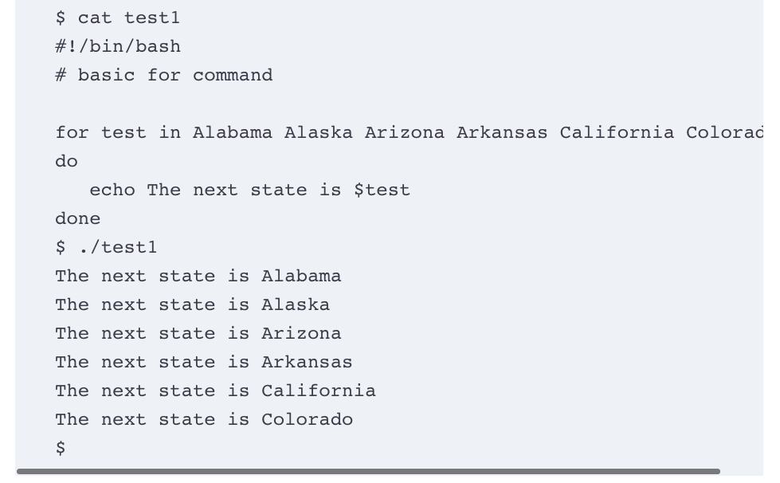

For the week-3 task you need to do following.

Read Chapter 13, Chapter 14, Chapter 15, and Chapter 16 from the book Linux Command Line and Shell Scripting Bible, 3rd Edition.
The book is available for download inside our Class notes reading materials.

As you read the chapters you will notice different scripts. For an example script test-1.sh

You need to do the following:

Log in on ssh centos@3.68.91.255 and create directory called: --week-3.

Create .sh files for each script and execute scripts

Took screenshots after executing scripts.

Push all scripts to your GitHub repository inside the directory week-3

TIER 1 ONLY Create a pull request and post it as a comment on this issue. Inside the pull request, you need to post screenshots from step 3 so that we have confirmation you actually executed scripts.
you need to execute each script at our centos server ssh centos@3.68.91.255

The due date for this task is: Tue March 14th

