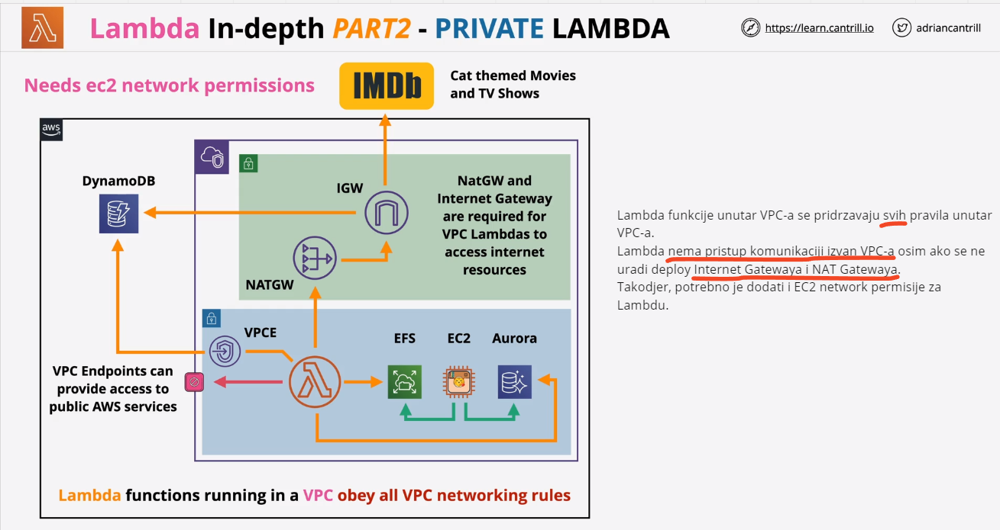
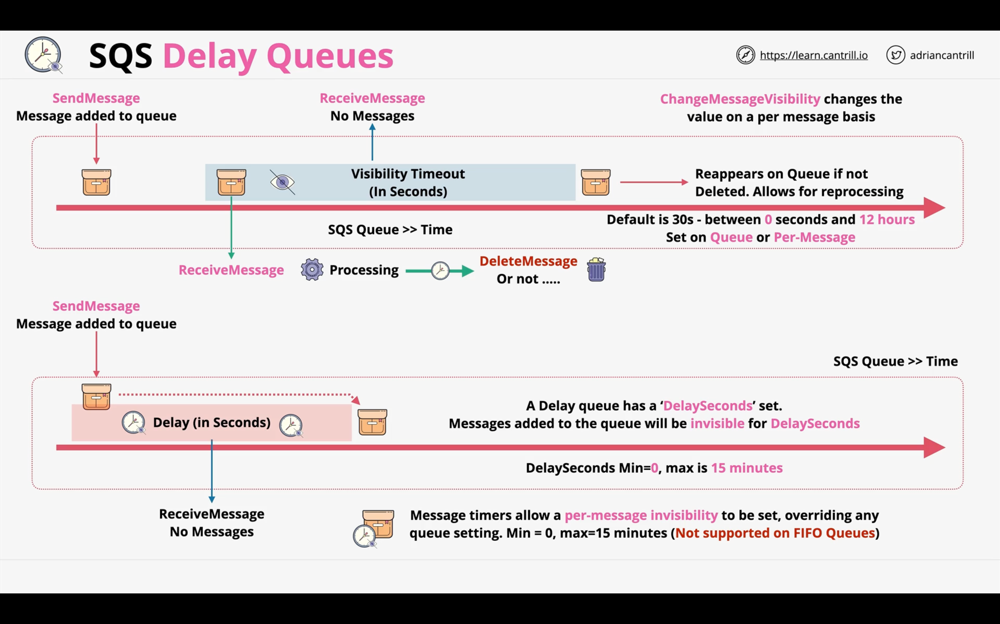

Zadatak za 12 sedmicu predavanja DevOps Mentorship programa je da kompletirate sljedece lekcije iz kursa AWS Certified Solutions Architect - Associate (SAA-C03) dostupnog na linku:
https://learn.cantrill.io/courses/enrolled/1820301

Serverless and Application Services

- [x] Architecture Deep Dive Part 1
- [x] Architecture Deep Dive Part 2
- [x] AWS Lambda Part 1
- [x] AWS Lambda Part 2
- [x] AWS Lambda Part 3
- [x] CludWatchEvents and Event Bridge
- [x] Automated EC2 Control using lambda and events Part 1 (DEMO)
- [x] Automated EC2 Control using lambda and events Part 2 (DEMO)
- [x] Serverless Architecture
- [x] Simple Notification Service (SNS)
- [x] Step Functions
- [x] API Gateway 101
- [x] Build a serverless app part 1
- [x] Build a serverless app part 2
- [x] Build a serverless app part 3
- [x] Build a serverless app part 4
- [x] Build a serverless app part 5
- [x] Build a serverless app part 6
- [x] Simple Queue Service (SQS)
- [x] SQS Stadanard vs FIFO Queus
- [x] SQS Delay Queues


# 1. Architecture Deep Dive Part 1 

Kao buduce Solution arhitekte, ne mozemo da nesto napravimo a da u potpunosti ne razumijemo arhitekturu. U zavisnosti od od zahtjeva, biramo razlicitu arhitekturu.

**Event-Driven Architecture**

**Monolitic Architecture**

U monolitic arhitekturi treba ocekivati da su generalno sve komponente na istom serveru direktno konektovane i da imaju isti codebase. Ne mozes skalirati jednu bez druge komponente, to znaci da se skaliranje odvija vertikalno. Isto tako, kada je jedna komponente failed, znaci da su i sve ostale failed. Takodjer, treba istaci da su i troskovi isti za sve komponente, jer te iste komponetne su uvijek running i zbog toga uvijek iziskuju troskove, cak iako processing engine ne radi nista. 


**Tiered Architecture**

`Tiered arcitecture` - tu imamo razlicite tiere, i oni mogu biti na razlicitom ili istom serveru. Tired u odnosu na Monolitic ima odredjene prednosti, moze se skalirati vertikalno ali i horizontalno. Processing dio koristi `Load Balancer` koji radi horizontalno skaliranje, samim tim veca je dostupnost, jer ako jedna instanca padne, druga ce da preuzme. 
Ova arhitektura nije perfekta arhitektura, zbog dvije stvari, jer upload zahtijeva od processinga da postoji i potreban mu je njegov respond, te processing mora nesto running ili ce biti failure. 


# 2. Architecture Deep Dive Part 2

`Queue` je sistem koji `prihvata poruke` koje se dodaju na njega i mogu se primiti ili povuci s njega.
`Queue se nalazi izmedju dva tiera, izmedju UPLOAD i PROCESSING`
U mnogim queue postoji `ordering`, i u mnogim slucajevima poruke se primaju iz queue u `FIFO` (First in, First out architecture), ali treba napomenuti nije uvijek ovakav slucaj. 


U ovom slucaju, arhitektura radi na malo drugaciji nacin:

- Upload ide na S3 Bucket umjesto da ide na Processing tier

- Dodaje se poruka u queue sa detaljima gdje je lokacija, koja je velicina potrebna i sl.

- Upload ne zavisi od Processinga i koristi asinhronizivanu komunikaciju gdje upload tier salje poruku nakon koje moze da ceka u pozadini ili da nastavi raditi ostale stvari dok processing odradi svoj zadatak. 

Sa druge strane Queuea postoji konfigurisana `auto scaling group`. 

`Queue lenght` je broj itemsa u Queue dodani od strane Upload tiera. Auto Scaling grupa detektira to i povecava zeljeni kapacitet instanci sa 0 na `X` i zbog toga instance su opskrbljene Auto Scaling grupom. Te instance pocinju da `pullaju` queue i primaju poruke ispred queue. Te poruke sadrze podatke za posao ali sadrze i lokaciju S3 bucketa i lokaciju objekata u tom S3 bucketu. Kada se poslovi obrade na instancama, brisu se iz queue. Kada je queue lenght kratak, onda auto scaling grupa smanjuje zeljeni kapacitet instanci. 
Nakon sto se svi poslovi preuzmu sa queue i obrade na instancama, onda auto scaling grupa smanji kapacitet instanci na `0`. 


Postavljajuci queue izmedju dva aplikaciona tiera - time se radzvajaju ti tieri. Jedan tier dodaje poslove za queue dok drugi tier cita te poslove. 

Ovim nacinom, koristeci `Queue architecture`, komunikacija se ne odvija direktno. Komponente su razdvojene i skaliraju se samostalno ili neovisno, 
Processing koristi auto skaliranje i `moze da skalira od 0 do infinity instanci`. 

**Mikroservisna arhitektura**

To je skup mikroservisa, a mikroservisi rade individualne stvari veoma dobro kao sto je `upload, process i store and manage`

**Event-Driven Architectures**

prevedi mi ovo: Producers are things which produce events and the inverse of this are consumers - pieces of software which are ready and waiting for events to occur.

Ova arhitektura je kolekcija `event producers` koji mogu biti komponente aplikacije koje izravno ima komunikaciju sa korisnicima.
Isto tako mogu biti dijelovi infrastrukture (EC2), ili mogu biti komponente za monitoring sistema. Isto tako, to su dijelovi softvera koji generiraju ili proizvode evente kao reakciju na nesto, to moze biti kao kada korisnik klikne na submit - to je jedan primjer eventa. Kada bi odredjeni korisnik otvorio odredjenu mobilnu aplikaciju, to bi mogao biti dogadjaj koji bi se generirao i mogao bi se proslijediti drugim dijelovima sistema.
`Producers` su radnje koje proizvode evente, a inversija toga su `consumers` to su dijelovi softvera koji su spremni i cekaju da se eventi dogode.
Kod `producersa`, eventi se generiraju kada se nesto dogodi. To moze da bude kada se ucitavanje uspjesno izvrsi ili ne. Ti producersi produciraju evente. 
`Consumers` ne cekaju pasivno na te evente, vec ih dobivaju kada se pojave i tada poduzimaju akciju de obradjuju event. Poslije same obrade eventa, consumers se zaustavljaju. Na taj nacin se izbjegava nepotrebno trosenje resursa.
Na slici ispod je prikazan `Event-Router` koji stalno prosljedjuje informacije. On je visoko dostupna tacka razmjene izmedju `event producer` i `event consumer`. 
Npr. Kada se eventi generiraju od strane producera, oni se salju putem rutera ka event customer tako sto se dodaju u event bus.


## 3. AWS Lambda - part 1

`Lambda` je funkcija kao servis (`FaaS`) ili brzi produkt. Kratko receno to je dio koda koji Lambda pokrece. To znaci da pruzamo Lambdi specijalni `short-running` i `focused code` a Lambda se brine o tom kodu i naplacuje samo ono sto koristimo. 
Kada se kreira nova Lambda funkciju, mora se odabrati `runtime` koji zelimo koristiti. `Runtime` odredjuje okruzenje koje se koristi za izvrsavanje koda kada se Lambda funkcija pozove. Npr. Ako odaberemo `Python` kao `runtime`, Lambda ce automatski pokrenuti Python kod u odgovarajucem izvrsnom okruzenju. Lambda podrzava razlicite `runtimeove` (Python, Ruby, Java, Go, C#).
`CPU resursi` se dodjeljuju automatski i dinamicki od strane Lambde, ovisno o kolicini memorije koju smo konfigurirali za Lambda funkciju. Kada Lambda funkcija koristi vise memorije, automatski ce se dodijeliti vise CPU resursa kako bi se osiguralo brze izvodjenje odredjene funkcije.

```bash 

VAZNO: ako vidimo ili cujemo pojam Docker, to nije Lambda, jer je Docker antipattern za Lambda funkcije.
DOCKER na ispitu se odnosi na tradicionalnu kontejnirizaciju - koriscenje odredjene Docker slike za pokretanje kontejnera i upotrebu u kontejnerizovanom okruzenju kao sto je ECS.

```


Lambda funkcije mogu se izvrsavati do 900 sekundi ili 15 minuta.


Upotreba Lambde:


# 4. AWS Lambda - part 2

Lambda ima dva networking moda: `public` - koji je ujedno i default, i `VPC` 

Po defaultu Lambda koristi public networking- to znaci da ima network konekciju `public space AWS servisima` i `public internetu`. Moze da se konektuje na oba, sve dok koristi metode autentifikacije i autorizacije. 

**Public Lambda**


**Private Lambda**



```bash

VAZNO: Lambdu unutar naseg VPC-a moramo da posmatramo kao i sve druge resurse unutar VPC-a!

```

**Security** - `Lambda execution roles` su IAM role koje su pridruzene Lambda funkcijama i kontroliraju permisije koje Lambda funkcija prima. `Lambda resource policy` kontrolira koje usluge i accounti mogu pozvati Lambda funkcije.


Lambda koristi `CloudWatch, CloudWatch Logs i X-Ray` a razlicite aspekte `logging` i `monitoringa`.


```bash

EXAM Scenario: Pokusaj uspostavljanja dijagnoze zasto Lambda funkcija ne radi i ne postoji nista u CloudWatch Logsu. ANSWER: Ne postoje required permissions via Execution role

```

# 5. AWS Lambda - part 3

Imamo tri razlicite verzije invoking (pozivanja) Lambda funkcija: `Synchronous invocation`, `Asynchronous invocation`, `Event Source mappings`.

**Synchronous invocation**


`Synchronous invocation` je pozivanje gdje klijent salje zahtjev funkciji i ceka na odgovor dok funkcija ne zavrsi izvodjenje i vrati rezultat. To znaci da ce klijent biti blokiran dok funkcija ne dovrsi svoje izvrsavanje i vrati rezultat.


**Asynchronous invocation**

`Asynchronous invocation` je pozivanje gdje klijent salje zahtjev funkciji, ali ne ceka na rezultat. Umjesto toga, funkcija odmah vraca potvrdni odgovor klijentu i nastavlja s izvrsavanjem asinkrono. Klijent moze kasnije provjeriti rezultat poziva funkcije putem drugog mehanizma kao sto je `checking the invocation status`.


**Event source mapping**

`Event source mapping` je konfiguracija koja omogucava Lambda funkciji automatsko konzumiranje eventa s odrefjenog izvora dogadjaja. Ono uspostavlja vezu izmedju event source i Lambda funkcije, omogucavajuci funkciji da obradjuje evente kako se desavaju. Event source mapping se cesto koristi prilikom integracije Lambda funkcija s uslugama koje su orijentisane na evente, poput `Amazon S3, Amazon DynamoDB Streams, Amazon Kinesis Data Streams ili Amazon Simple Notification Service (SNS)`. Kreiranjem event source mappinga, definise se vrsta event source i odredjuje koja Lambda funkcija ce biti triggerovana svaki put kad se desi novi dogadjaj.


**Versions**


**Lambda function handler**

U AWS Lambda, "cold start" i "warm start" se odnose na dvije razlicite situacije u kojima se moze pozvati Lambda funkcija.

`Cold Start` se desava kada se Lambda funkcija poziva prvi put ili nakon nekog perioda neaktivnosti. U ovoj situaciji, AWS mora alocirati potrebne racunarske resurse za izvrsavanje funkcije. 

`Warm Start` start se desava kada se Lambda funkcija poziva nakon sto je vec inicijalizovana i jos uvijek je aktivna u okruzenju koje se izvrsava, odnosno koje je aktivno. Prednost warm starta je sto Lambda funkcija moze odmah poceti s izvrsavanjem jer su resursi vec alocirani i inicijalizirani. To smanjuje latenciju i poboljsava vrijeme odziva za naredne pozive.

# 6. CloudWatchEvents and EventBridge

`CloudWatch Events` je servis koja pruza gotovo u real-timeu tok sistemskim eventa koji se javljaju u AWS okruzenju. Omogucava monitoring dogadjaja iz razlicitih AWS servisa, kao sto su EC2 instance, Lambda funkcije, S3 bucketi i sl.. CloudWatch Events omogucava definisanje pravila koja odgovaraju odredjenim event patternima i trigeruje akcije u odgovoru na te evente. Te akcije mogu ukljucivati pozivanje AWS Lambda funkcija, pokretanje ECS taskova, slanje notifikacija putem SNS-a i jos mnogo toga. CloudWatch Events se uglavnom fokusira na evente unutar AWS ekosistema.

EventBridge is a serverless event bus service that allows you to build event-driven architectures and integrate various event sources and targets, both within and outside the AWS ecosystem. It provides a central event bus that acts as a hub for routing events between different services and applications. EventBridge supports both AWS services and third-party SaaS (Software-as-a-Service) applications as event sources and targets. It allows you to define rules to filter and transform events and route them to specific targets. EventBridge supports a wide range of integrations and offers more flexibility in connecting events from different sources and sending them to different targets.

`EventBridge` je serverless servis za event bus koji omogucava izgradnju event-driven arhitekture i integraciju razlicitih izvora i ciljeva dogadjaja, kako unutar, tako i izvan AWS ekosistema. EventBridge podrzava kako AWS usluge, tako i aplikacije trecih strana `SaaS (Software-as-a-Service)`. Omogucava definisanje pravila za filtriranje i transformaciju eventa i rutira ih ka odredjenim ciljevima. EventBridge podrzava sirok spektar integracija i pruza vecu fleksibilnost u povezivanju eventa iz razlicitih izvora i slanju ka razlicitim targetima.


# 7. Automated EC2 Control using Lambda and Events - part 1


# 8. Automated EC2 Control using Lambda and Events - part 2


# 9. Serverless Architecture


# 10. Simple Notification Service

`SNS` je usluga koja omogucuje jednostavno slanje poruka i obavjestenja putem razlicitih kanala kao sto su `e-mail, SMS, mobilne push notifikacije, HTTP endpointovi i Lambda`. SNS omogucuje komunikaciju izmedju aplikacija, sistema i korisnika putem brzih i skalabilnih metoda.


# 11. Step Functions

`Step Functions` olaksava izgradnju, upravljanje i skaliranje kompleksnih poslovnih procesa.


# 12. API Gateway 101

`API Gateway `je servis koji nam omogucava kreiranje i upravljanje API - to je nacin na koji aplikacije komuniciraju jedna s drugom. 

```bash

NPR. Ako koristimo Netflix aplikaciju na nasem tv-u, koristimo API da komuniciramo sa Netflix backend servisima

```


**Kolegica Alma je uradila super predavanje na ovu temu: https://www.youtube.com/watch?v=xysv_eSb1tQ**

# 13. Build A Serverless App - Pet-Cuddle-o-Tron - PART1

`Serverless app` koja koristi `Step funtions, Lambda, API Gateway i S3 Static website hosting.` 


# 14. Build A Serverless App - Pet-Cuddle-o-Tron - PART2


# 15. Build A Serverless App - Pet-Cuddle-o-Tron - PART3


# 16. Build A Serverless App - Pet-Cuddle-o-Tron - PART4


# 17. Build A Serverless App - Pet-Cuddle-o-Tron - PART5


# 18. Simple Queue Service


# 19. SQS Standard vs FIFO Queues


# 20. SQS Delay Queues



