In this module you will use AWS Cloudformation to set up your application and the infrastructure associated with it. You will leverage AWS Elastic Beanstalk to simplify things.

# Elastic Beanstalk Application

In this step, you will retrieve a copy of the sample app’s code and create code commit repo to host the code. The pipeline takes code from the source and then performs actions on it.

## Stage 1: Create Code Commit Repo

```bash

aws codecommit create-repository --repository-name gitflow-workshop --repository-description "Repository for Gitflow Workshop"

```

```bash

git clone https://git-codecommit.us-east-1.amazonaws.com/v1/repos/gitflow-workshop

```


## Stage 2: Download the sample code and commit your code to the repository

1. Download the Sample App archive by running the following command from IDE terminal.

```bash

ASSETURL="https://static.us-east-1.prod.workshops.aws/public/442d5fda-58ca-41f0-9fbe-558b6ff4c71a/assets/workshop-assets.zip"; wget -O gitflow.zip "$ASSETURL"

```


2. Unarchive and copy all the contents of the unarchived folder to your local repo folder.

```bash

unzip gitflow.zip -d gitflow-workshop/

```


3. Change the directory to your local repo folder. Run git add to stage the change.

```bash

cd gitflow-workshop

```

```bash

git add -A

```


4. Run git commit to commit the change and push it to master

```bash

git commit -m "Initial Commit"

```

```bash

git push origin master

```


And you should see something similar to:

```bash

Counting objects: 17, done.
Compressing objects: 100% (16/16), done.
Writing objects: 100% (17/17), 49.62 KiB | 4.96 MiB/s, done.
Total 17 (delta 1), reused 0 (delta 0)
To https://git-codecommit.us-east-1.amazonaws.com/v1/repos/gitflow-workshop
 * [new branch]      master -> master

```

## Create Elastic Beanstalk Application

To use Elastic Beanstalk we will first create an application, which represents your web application in AWS. In Elastic Beanstalk an application serves as a container for the environments that run your web app, and versions of your web app's source code, saved configurations, logs, and other artifacts that you create while using Elastic Beanstalk.

Run the following AWS CloudFormation template to create

- Elastic Beanstalk application - think of it as a folder that will hold the components of your Elastic Beanstalk

- S3 bucket for artifacts - place to put your application code before deployment

```bash

aws cloudformation create-stack --template-body file://appcreate.yaml --stack-name gitflow-eb-app

```


AWS CloudFormation begins creating the resources that are specified in the template. Your new stack, gitflow-eb-app, appears in the list at the top portion of the Cloudformation console . Its status should be CREATE_IN_PROGRESS. You can see detailed status for a stack by viewing its events.


# Master Environment

## Creating an AWS Elastic Beanstalk Master Environment

You can deploy multiple environments when you need to run multiple versions of an application. For example, you might have development, integration, and production environments

Use the following AWS CloudFormation templates to set up the elastic beanstalk application and codepipeline to do auto store the artifacts.

```bash

aws cloudformation create-stack --template-body file://envcreate.yaml --parameters file://parameters.json --capabilities CAPABILITY_IAM --stack-name gitflow-eb-master

```


Your stack might take several minutes to create—but you probably don't want to just sit around waiting. If you're like us, you'll want to know how the stack creation is going. Your new stack, gitflow-eb-master, appears in the list at the top portion of the Cloudformation console . Its status should be CREATE_IN_PROGRESS. You can see detailed status for a stack by viewing its events. The CREATE_COMPLETE event is logged when the resource is successfully created.

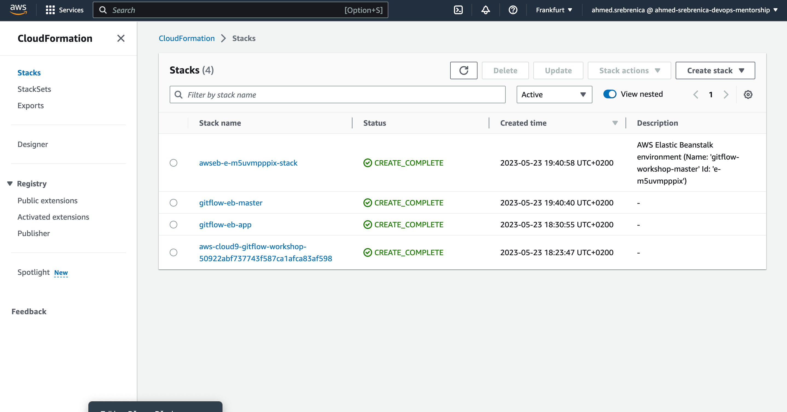

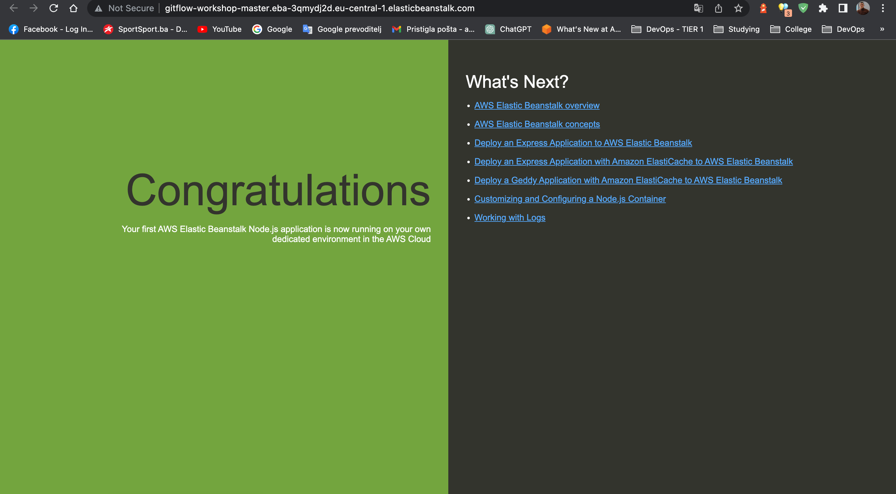

## AWS CodePipeline

AWS CodePipeline is a continuous delivery service you can use to model, visualize, and automate the steps required to release your software. You can quickly model and configure the different stages of a software release process. CodePipeline automates the steps required to release your software changes continuously.

Above cloudformation template will also create and configure a simple AWS CodePipeline with three actions: source, build and deploy.


After your pipeline is created, the pipeline status page appears and the pipeline automatically starts to run. You can view progress as well as success and failure messages as the pipeline performs each action.

To verify your pipeline ran successfully, monitor the progress of the pipeline as it moves through each stage by going to CodePipeline Console . The status of each stage will change from No executions yet to In Progress, and then to either Succeeded or Failed. The pipeline should complete the first run within a few minutes.

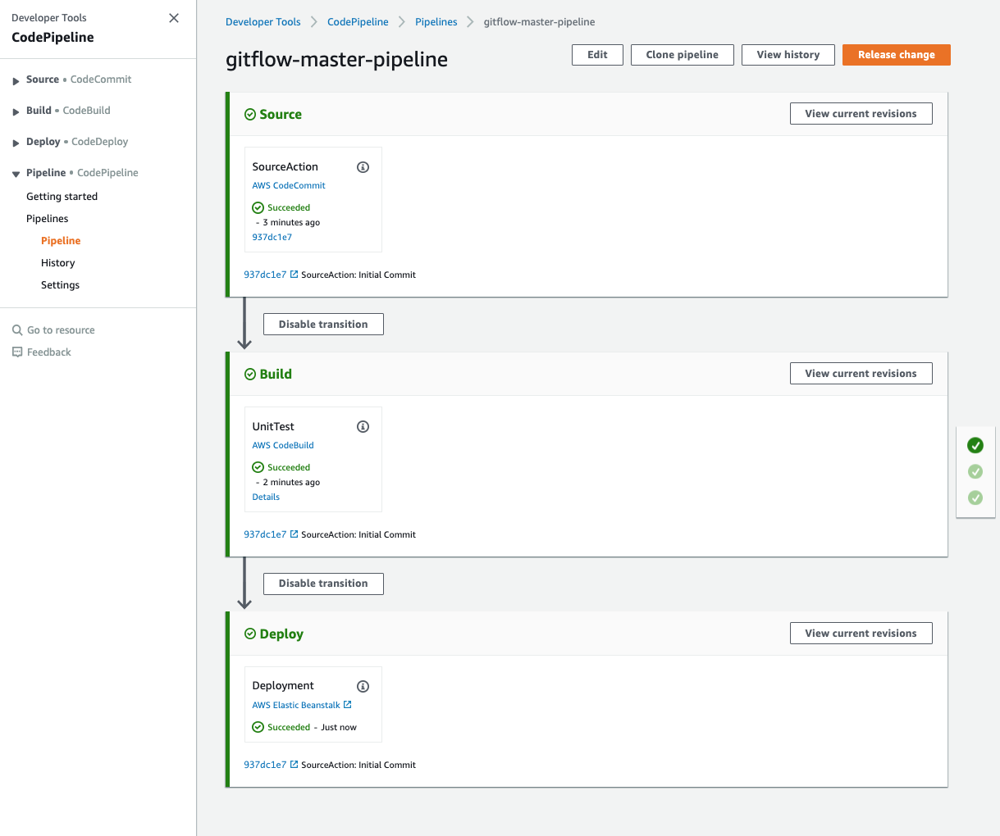

# Lambda

## What Is AWS Lambda?

AWS Lambda is a compute service that lets you run code without provisioning or managing servers. AWS Lambda executes your code only when needed and scales automatically, from a few requests per day to thousands per second. You pay only for the compute time you consume - there is no charge when your code is not running. With AWS Lambda, you can run code for virtually any type of application or backend service - all with zero administration.

For this workshop we are using lambda function to create codepipeline and elasticbeanstalk when a branch or tag is created.

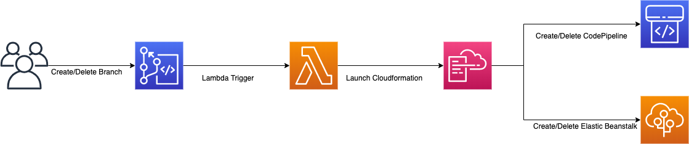

# Lambda Creation

## Create Lambda

You can configure a CodeCommit repository so that code pushes or other events trigger actions, such as invoking a function in AWS Lambda. The following steps include creating a Lambda function which will be used with a CodeCommit trigger.

```bash

aws cloudformation create-stack --template-body file://lambda/lambda-create.yaml --stack-name gitflow-workshop-lambda --capabilities CAPABILITY_IAM

```


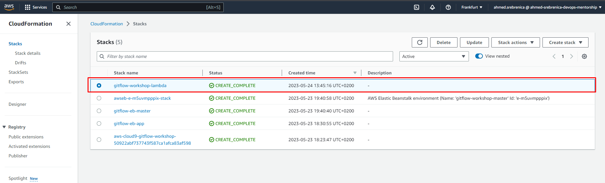

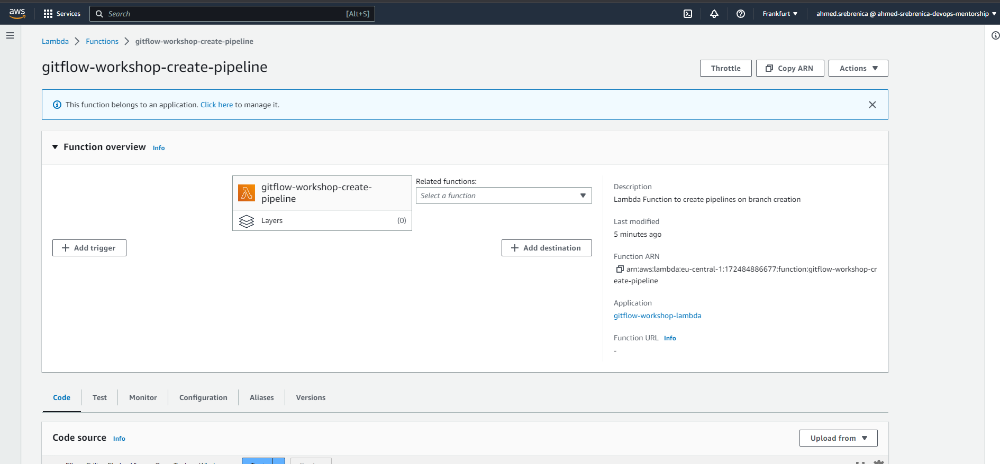

## AWS CodeCommit Trigger

You can configure a CodeCommit repository so that code pushes or other events trigger actions, such as sending a notification from Amazon Simple Notification Service (Amazon SNS) or invoking a function in AWS Lambda. You can create up to 10 triggers for each CodeCommit repository.

Triggers are commonly configured to:

- Send emails to subscribed users every time someone pushes to the repository.

- Notify an external build system to start a build after someone pushes to the main branch of the repository

## Create a Trigger in AWS CodeCommit for an Existing AWS Lambda Function

In this step you will create a trigger in CodeCommit which invokes a Lambda function when a branch or tag is created.

1. Open the CodeCommit  console

2. In Repositories, choose the gitflow-workshop repository where you want to create triggers for repository events.

3. In the navigation pane for the gitflow-workshop repository, choose Settings, and then choose Triggers.

4. Choose Create trigger. In Create trigger, do the following:

- In Trigger name, enter a name for the trigger (for example, CreateBranch).
- In Events, choose the repository events that trigger the Lambda function: Create branch or tag.
- In Branches, leave the selection blank, because this default option applies the trigger to all branches automatically.
- In Choose the service to use, choose AWS Lambda. In Lambda function, choose the function name from the list, or enter the ARN for the function.

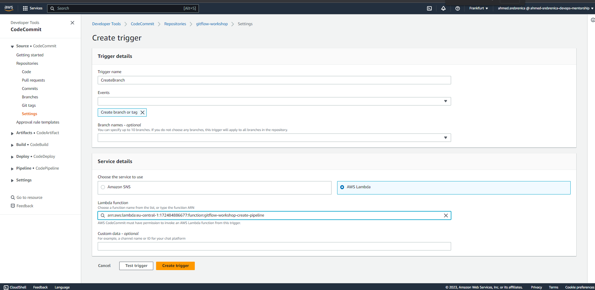

5. Choose Create trigger. In Create trigger, do the following:

- In Trigger name, enter a name for the trigger (for example, DeleteBranch).
- In Events, choose the repository events that trigger the Lambda function: Delete branch or tag.
- In Branches, leave the selection blank, because this default option applies the trigger to all branches automatically.
- In Choose the service to use, choose AWS Lambda. In Lambda function, choose the function name from the list, or enter the ARN for the function.

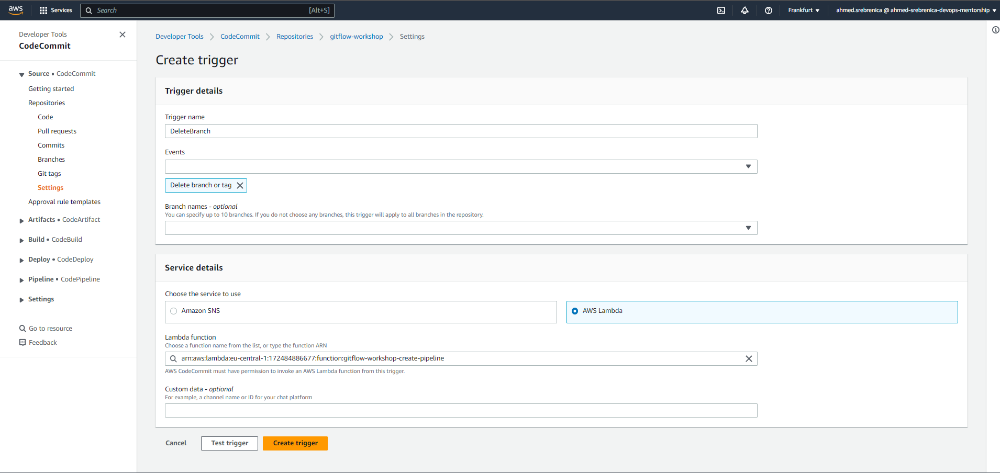

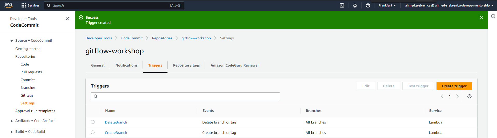

# Develop Branch

## Create Develop Branch

When using the git-flow extension library, executing git flow init on an existing repo will create the develop branch:

1. Initialize gitflow

```bash

Admin:~/environment/gitflow-workshop (master) $ git flow init

Which branch should be used for bringing forth production releases?
- master
Branch name for production releases: [master]
Branch name for "next release" development: [develop]

How to name your supporting branch prefixes?
Feature branches? [feature/]
Release branches? [release/]
Hotfix branches? [hotfix/]
Support branches? [support/]
Version tag prefix? []

```

2. List the current branches. The current branch will be highlighted in green and marked with an asterisk.

```bash

Admin:~/environment/gitflow-workshop (master) $ git branch
* develop
 master

```

3. Push commits made on a local branch to a remote repository.

```bash

Admin:~/environment/gitflow-workshop (develop) $ git push -u origin develop

```

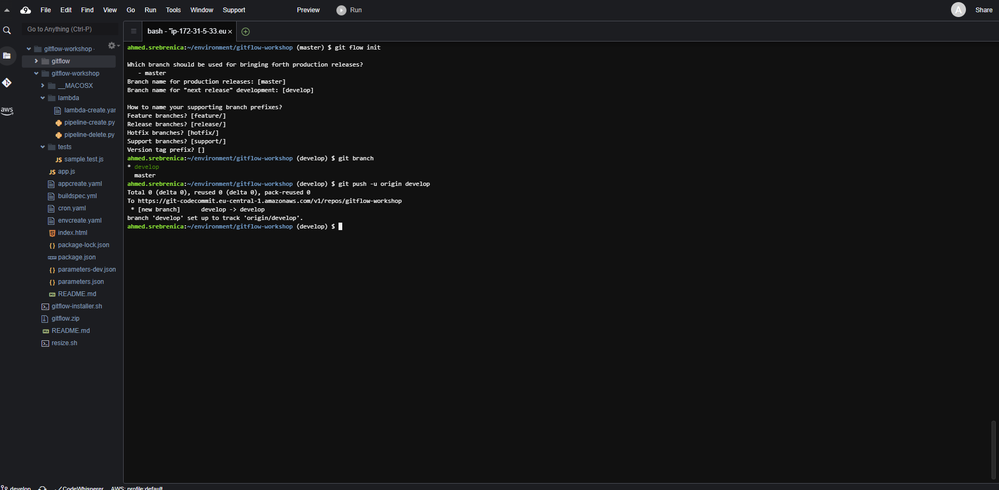

# Create Development Environment

After pushing the commits to development branch, the lambda function you created earlier will automatically detect a new develop branch created and codecommit will trigger the function to create the development environment and code pipeline.

Your new stack, gitflow-workshop-develop, appears in the list at the top portion of the Cloudformation console . Once the cloudformation successfully created the stack go to AWS Elastic Beanstalk Environment Management Console .

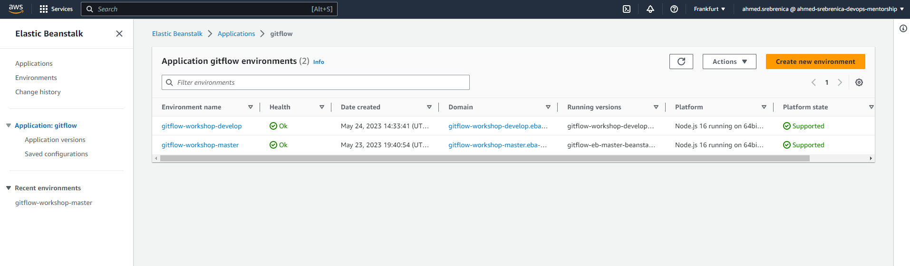

Go to the environment URL for the **gitflow-workshop-develop** application and the web browser should display the sample nodejs application that you just deployed.

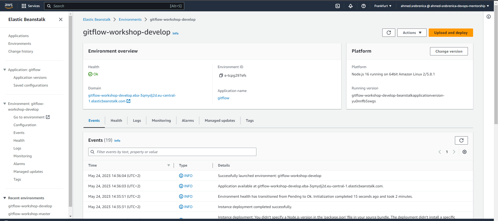

Cloudformation template also creates a new code pipeline gitflow-workshop-develop-pipeline for the development branch. This also uses event-based Amazon CloudWatch Events rules as the change detection method for your pipelines with a CodeCommit repository. When Amazon CloudWatch Events rule detects source changes it starts the pipeline.

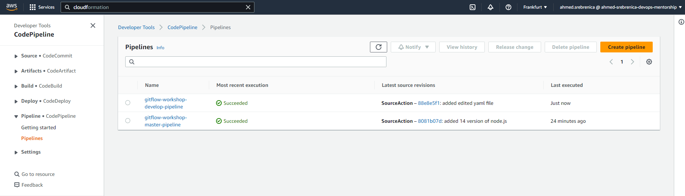

## Manual creation steps

You can manually trigger the creation of the development environment

```bash

aws cloudformation create-stack --template-body file://envcreate.yaml --parameters file://parameters-dev.json --capabilities CAPABILITY_IAM --stack-name gitflow-workshop-develop

```


# Feature Branches

Each new feature should reside in its own branch, which can be pushed to the central repository for backup/collaboration. But, instead of branching off of master, feature branches use develop as their parent branch. When a feature is complete, it gets merged back into develop. Features should never interact directly with master.

The idea is to create a pipeline per branch. Each pipeline has a lifecycle that is tied to the branch. When a new, short-lived branch is created, we create the pipeline and required resources. After the short-lived branch is merged into develop, we clean up the pipeline and resources to avoid recurring costs.

# Create Feature Branch Environment

## Create Feature Branch 

The name of the feature is up to you, choose something simple and short, describing what you are doing. For this workshop we are going to change color by simply editing index.html file. To start a feature named change-color you’ll use:

```bash

git flow feature start change-color

```

This will automatically do the following:

create a new branch named feature/change-color from the develop branch,
checkout the feature/change-color branch So, yes, you’re ready to go! Just hack, commit, push, . . . You’ This action performs the following:

And you should see something similar to:

```bash

Switched to a new branch 'feature/change-color'                                                                                       

```

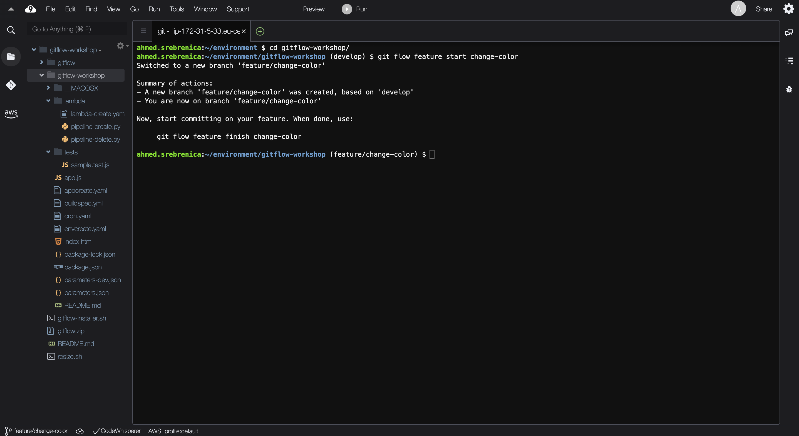

## Create feature branch environment

The lambda function you created earlier will automatically detect a new branch it will trigger the function to create the environment and code pipeline.

## Commit a change and then update your app

In this step, you will revise the sample code and commit the change to your repository. CodePipeline will detect your updated sample code and then automatically initiate AWS CodeBuild to build the source code. CodePipeline then uses Elastic Beanstalk to deploy the build output to the environment.

`Edit line:38 in index.html. We are going to change the color from purple to green`


1. The git status command displays the state of the working directory and the staging area.

```bash

ConsoleAccess:~/environment/gitflow-workshop (feature/change-color) $ git status      

```

2. Run git add to stage the change.

```bash

ConsoleAccess:~/environment/gitflow-workshop (feature/change-color) $ git add -A        

```

3. Run git commit to commit the change and push it to feature/change-color branch

```bash

ConsoleAccess:~/environment/gitflow-workshop (feature/change-color) $ git commit -m "Changed Color"    
ConsoleAccess:~/environment/gitflow-workshop (feature/change-color) $ git push --set-upstream origin feature/change-color

```

And you should see something similar to:

```bash

Counting objects: 3, done.                                                            Compressing objects: 100% (3/3), done.

```


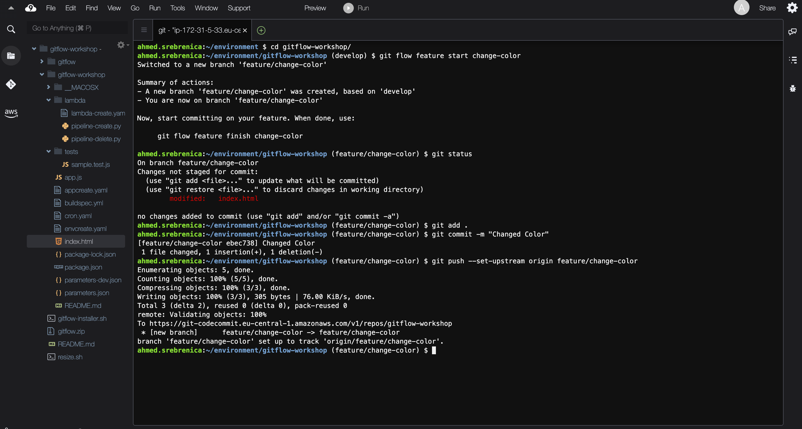

Amazon CloudWatch Events rule detects source changes it starts the pipeline. To verify your pipeline ran successfully, monitor the progress of the pipeline gitflow-workshop-feature-change-color-pipeline as it moves through each stage by going to CodePipeline Console

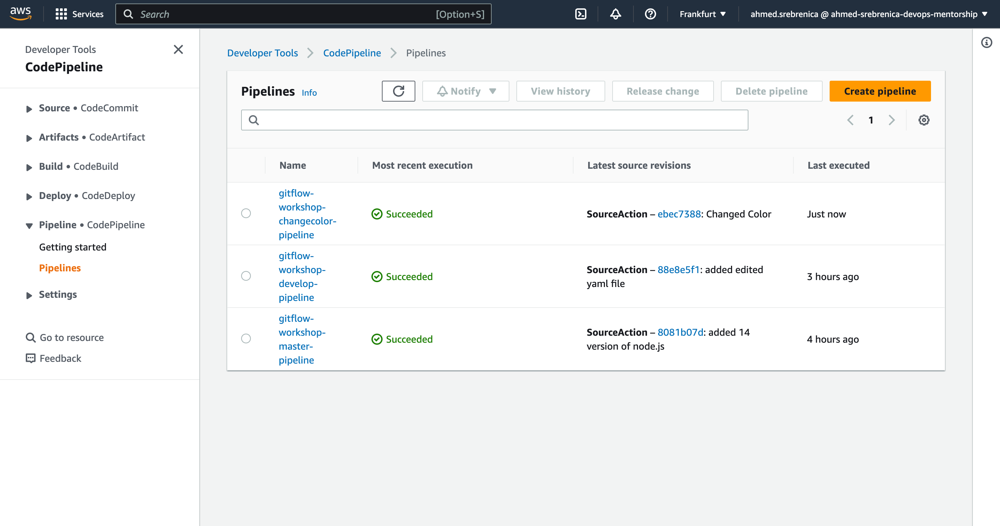

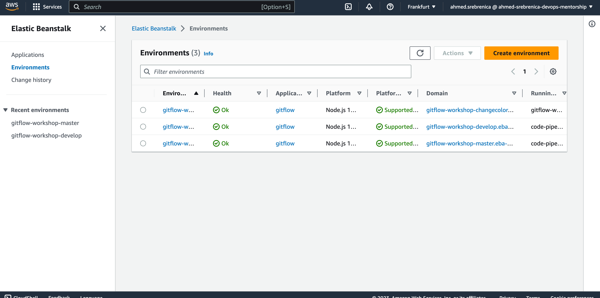


## Manual creation steps

You can manually trigger the creation of the development environment

```bash

aws cloudformation create-stack --template-body file://envcreate.yaml --capabilities CAPABILITY_IAM --stack-name gitflow-workshop-changecolor --parameters ParameterKey=Environment,ParameterValue=gitflow-workshop-changecolor ParameterKey=RepositoryName,ParameterValue=gitflow-workshop ParameterKey=BranchName,ParameterValue=feature/change-color

```

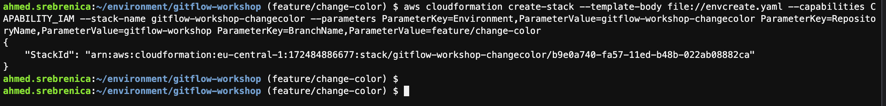


# Feature Finish

## Step 1: Finish feature development

Once you have verified the changes you made and is ready to merge to develop branch.Finish the development of a feature by executing git flow feature finish change-color.

```bash

ConsoleAccess:~/environment/gitflow-workshop (feature/change-color) $ git flow feature finish change-color

```

This action performs the following:

Merges **change-color** into **develop**

Removes the feature branch

Switches back to develop branch

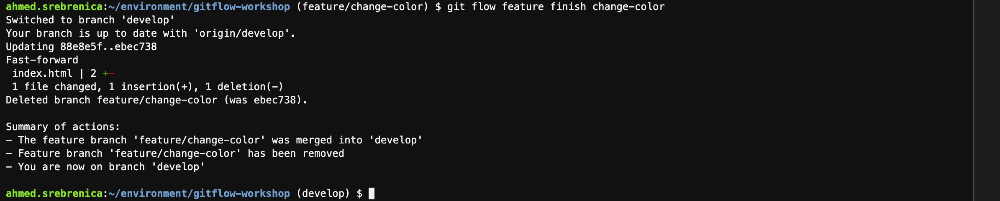

## Step 2: Delete the feature branch change-color and push it to remote at the same time

```bash

ConsoleAccess:~/environment/gitflow-workshop (develop) $ git push origin --delete feature/change-color                                                                                                                            
To https://git-codecommit.us-east-1.amazonaws.com/v1/repos/gitflow-workshop
 - [deleted]         feature/change-color

```

This step will trigger the **DeleteBranch** lambda function you created earlier and will delete the **gitflow-workshop-feature-change-color** Elastic Beanstalk environment and **gitflow-workshop-feature-change-color-pipeline** Code Pipleline.

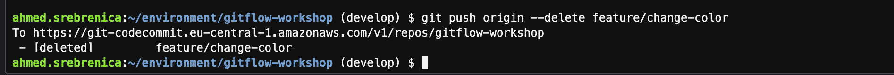

## Step 3: Push the develop branch changes to codecommit

```bash

ConsoleAccess:~/environment/gitflow-workshop (develop) $ git push --set-upstream origin develop

```

And you should see the output something similar to:

```bash

Counting objects: 3, done.
Compressing objects: 100% (3/3), done.
Writing objects: 100% (3/3), 294 bytes | 294.00 KiB/s, done.
Total 3 (delta 2), reused 0 (delta 0)
To https://git-codecommit.us-east-1.amazonaws.com/v1/repos/gitflow-workshop
   d33e3e3..ac9881b  develop -> develop
Branch develop set up to track remote branch develop from origin.

```
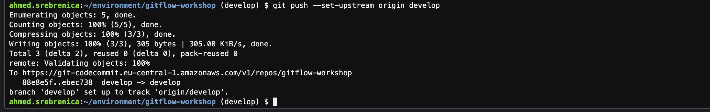

Amazon CloudWatch Events rule detects changes in the **develop** branch it starts the pipeline. To verify your pipeline ran successfully, monitor the progress of the pipeline **gitflow-workshop-develop-pipeline** as it moves through each stage by going to CodePipeline Console . After the pipeline ran successfully, go to the environment URL for the **gitflow-workshop-develop** application to see the latest changes.

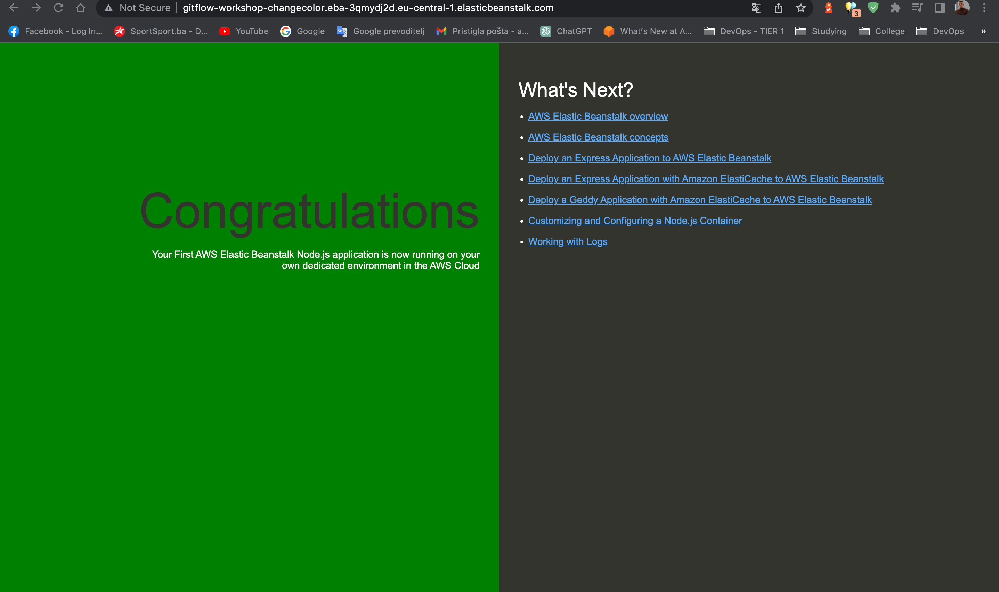

# Cleanup

## Delete Develop & Master Environments

```bash

aws cloudformation delete-stack --stack-name gitflow-eb-master
aws cloudformation delete-stack --stack-name gitflow-workshop-develop

```

## Delete Feature Environment

```bash

aws cloudformation delete-stack --stack-name gitflow-workshop-feature-change-color

```

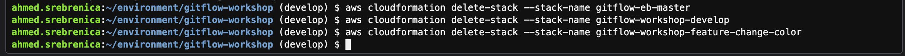

## Delete Lambda Functions

```bash

aws cloudformation delete-stack --stack-name gitflow-workshop-lambda

```

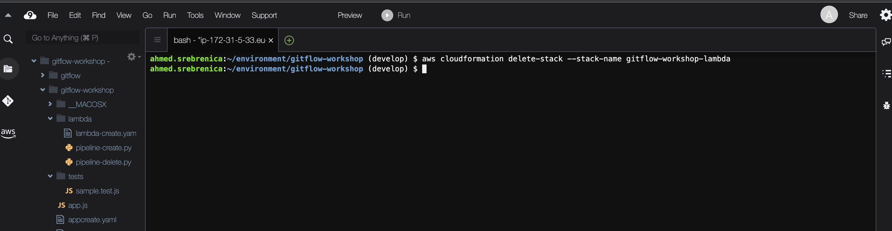

## Delete Elastic Beanstalk Application

`Empty the S3 bucket used to store the artifacts before deleting the elasticbeanstalk application.`

```bash

aws cloudformation delete-stack --stack-name gitflow-eb-app

```

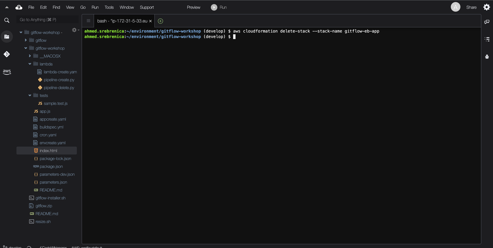

## Delete code commit repository

```bash

aws codecommit delete-repository --repository-name gitflow-workshop

```

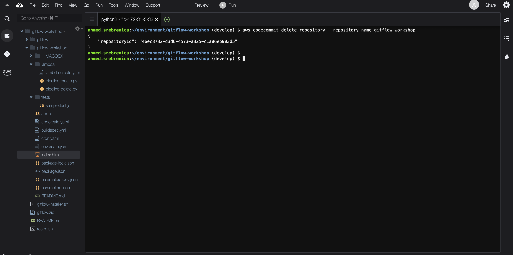


