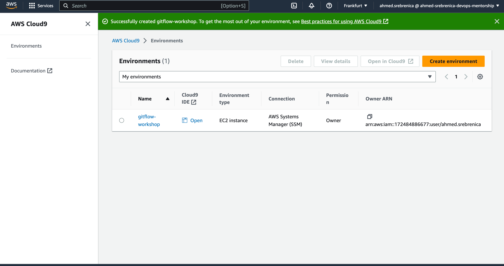
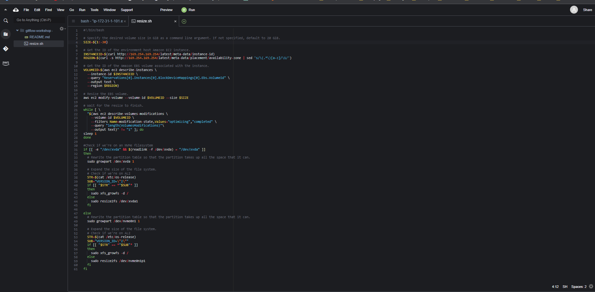
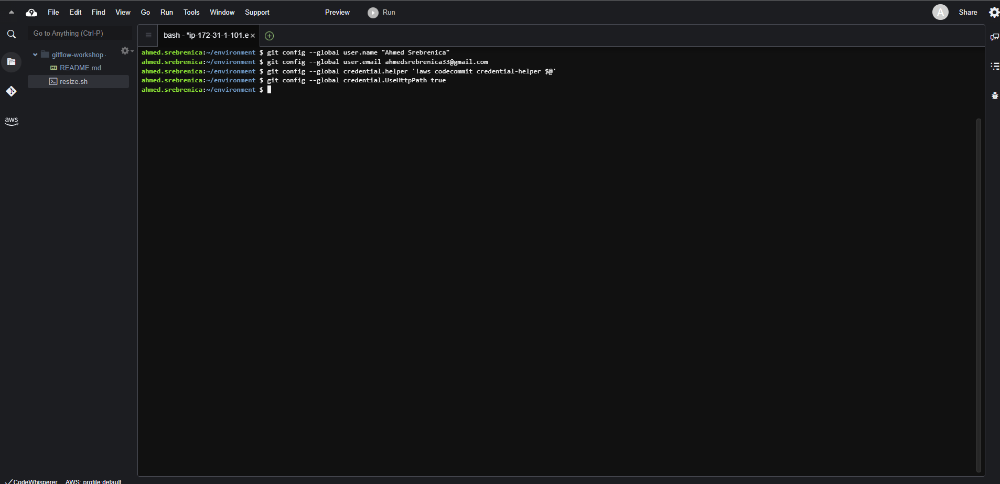
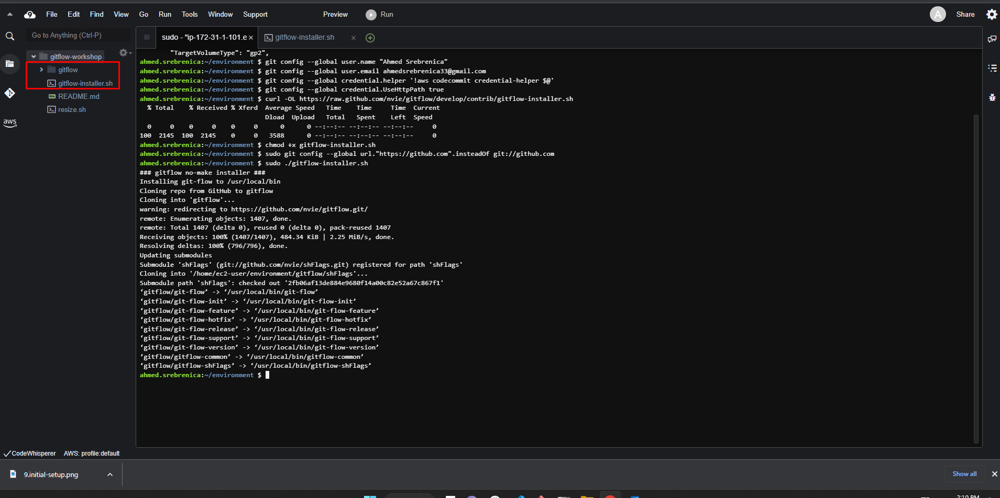

# Branching Models

There are two popular branching models that we see customers typically use in their organization. One is Trunk-based and other is Feature-based or "GitFlow" model.

## Trunk-based development

In Trunk-based model, developers collaborate on code in a single branch called “trunk” resisting any pressure to create other long-lived development branches by employing documented techniques. This leads to avoiding merging complexity and hence effort. At Amazon, we strongly encourage our teams to practice Continuous Integration via Trunk-based development where developers merge their changes several times a day into a central repository.

## Feature-based aka GitFlow development

So why do teams use Feature-based model? There are several reasons why:

Not many teams have achieved CI/CD nirvana
Multiple teams may be working on different feature releases with different launch timelines
Organizations that provide SAAS (Software As-A Service) may have customers who do not wish to be on the "latest" version at all times, and thus forcing them to create multiple "Release" and "Hotfix" branches
Certain teams within an Organization may have specific QA/UAT requirements that require manual approvals, that may delay the time since a new feature is introduced until it's released to production
We developed this workshop considering above, and also our customers have asked us for information that would help them use our tools to automate merge and release tasks.

## GitFlow

GitFlow involves creating multiple levels of branching off of master where changes to feature branches are only periodically merged all the way back to master to trigger a release.

Master always and exclusively contains production code

Develop is the basis for any new development efforts you make.

These two branches are so-called long-running branches: they remain in your project during its whole lifetime. Other branches, e.g. for features or releases, only exist temporarily: they are created on demand and are deleted after they've fulfilled their purpose.

## GitFlow guidelines

- Use development as a continuous integration branch.
- Use feature branches to work on multiple features.
- Use release branches to work on a particular release (multiple features).
- Use hotfix branches off of master to push a hotfix.
- Merge to master after every release.
- Master contains production-ready code.


For more details, please see Vincent Driessen's [branching model](https://nvie.com/posts/a-successful-git-branching-model/)

VAZNO: Route tables - internet gateway deny

# Create a Workspace

`AWS Cloud9 workspace should be built by an IAM user with Administrator privileges, not the root account user. Please ensure you are logged in as an IAM user, not the root account user.`

`Ad blockers, javascript disablers, and tracking blockers should be disabled for the cloud9 domain, or connecting to the workspace might be impacted. AWS Cloud9 requires third-party-cookies. You can whitelist the specific domains .`

## Launch AWS Cloud9 in EU-CENTRAL-1:

Sign in to AWS as the IAM user you've configured and open the AWS Cloud9 console.
In the AWS Cloud9 console, choose Create environment.
Select Create environment
Name it gitflow-workshop, and take all other defaults
When it comes up, customize the environment by closing the welcome tab and lower work area, and opening a new terminal tab in the main work area:





## Resize the Cloud9 instance

By default the Amazon EBS volume attached to the Cloud9 instance is 10 GiB, let's confirm this by typing the following in the terminal:

```bash

df -h

```


We can see that /dev/xvda1 is 10 GiB and has around 4.2 GiB free.

From the Cloud9 terminal, create a file called resize.sh:

```bash

touch resize.sh

```

Open resize.sh in Cloud9 and paste the bash script from the documentation:

```bash

#!/bin/bash

# Specify the desired volume size in GiB as a command line argument. If not specified, default to 20 GiB.
SIZE=${1:-20}

# Get the ID of the environment host Amazon EC2 instance.
INSTANCEID=$(curl http://169.254.169.254/latest/meta-data/instance-id)
REGION=$(curl -s http://169.254.169.254/latest/meta-data/placement/availability-zone | sed 's/\(.*\)[a-z]/\1/')

# Get the ID of the Amazon EBS volume associated with the instance.
VOLUMEID=$(aws ec2 describe-instances \
  --instance-id $INSTANCEID \
  --query "Reservations[0].Instances[0].BlockDeviceMappings[0].Ebs.VolumeId" \
  --output text \
  --region $REGION)

# Resize the EBS volume.
aws ec2 modify-volume --volume-id $VOLUMEID --size $SIZE

# Wait for the resize to finish.
while [ \
  "$(aws ec2 describe-volumes-modifications \
    --volume-id $VOLUMEID \
    --filters Name=modification-state,Values="optimizing","completed" \
    --query "length(VolumesModifications)"\
    --output text)" != "1" ]; do
sleep 1
done

#Check if we're on an NVMe filesystem
if [[ -e "/dev/xvda" && $(readlink -f /dev/xvda) = "/dev/xvda" ]]
then
  # Rewrite the partition table so that the partition takes up all the space that it can.
  sudo growpart /dev/xvda 1

  # Expand the size of the file system.
  # Check if we're on AL2
  STR=$(cat /etc/os-release)
  SUB="VERSION_ID=\"2\""
  if [[ "$STR" == *"$SUB"* ]]
  then
    sudo xfs_growfs -d /
  else
    sudo resize2fs /dev/xvda1
  fi

else
  # Rewrite the partition table so that the partition takes up all the space that it can.
  sudo growpart /dev/nvme0n1 1

  # Expand the size of the file system.
  # Check if we're on AL2
  STR=$(cat /etc/os-release)
  SUB="VERSION_ID=\"2\""
  if [[ "$STR" == *"$SUB"* ]]
  then
    sudo xfs_growfs -d /
  else
    sudo resize2fs /dev/nvme0n1p1
  fi
fi

```

Save the changes to resize.sh File -> Save (or [⌘]/[ctrl] + [s])
From the terminal execute the resize.sh bash script to resize the attached EBS volume to 30 GiB

```bash

bash resize.sh 30

```




# Initial Setup

The git config command is a convenience function that is used to set Git configuration values on a global or local project level. It is best practice to set up your git user.name and user.email when you set up a new Cloud9 environment using the following commands:

```bash

git config --global user.name "Full Name"

```

```bash

git config --global user.email email@amazon.com

```

## Configure the AWS CLI Credential Helper on Your AWS Cloud9 EC2 Development Environment

After you've created an AWS Cloud9 environment, you can configure the AWS CLI credential helper to manage the credentials for connections to your CodeCommit repository. The AWS Cloud9 development environment comes with AWS managed temporary credentials that are associated with your IAM user. You use these credentials with the AWS CLI credential helper. The credential helper allows Git to use HTTPS and a cryptographically signed version of your IAM user credentials or Amazon EC2 instance role whenever Git needs to authenticate with AWS to interact with CodeCommit repositories.

At the terminal, run the following commands to configure the AWS CLI credential helper for HTTPS connections:

```bash

git config --global credential.helper '!aws codecommit credential-helper $@'
git config --global credential.UseHttpPath true

```



## Install gitflow

Gitflow is a collection of Git extensions to provide high-level repository operations for Vincent Driessen's [branching model](https://nvie.com/posts/a-successful-git-branching-model/). At the terminal, run the following commands to install gitflow:

```bash

curl -OL https://raw.github.com/nvie/gitflow/develop/contrib/gitflow-installer.sh
chmod +x gitflow-installer.sh
sudo git config --global url."https://github.com".insteadOf git://github.com
sudo ./gitflow-installer.sh

```




