# Task - 13: AWS Code Family Workshop

https://catalog.us-east-1.prod.workshops.aws/workshops/752fd04a-f7c3-49a0-a9a0-c9b5ed40061b/en-US

Potrebno je odraditi:

- [x] Lab 1
- [x] Lab 2
- [x] Lab 3
- [x] Lab 4
- [x] Lab 5


## Introduction to AWS Code Family

Welcome to the Introduction to the AWS Code Family workshop!

In this workshop we will explore the AWS DevOps tooling to build and deploy a simple Java web application.

We will use AWS CodeCommit as a Git repository to store our code and AWS CodeArtifact to manage software packages. We will use AWS CodeBuild to compile the Java application, and AWS CodeDeploy to deploy the application to an EC2 web server. AWS CodePipeline will help orchestrate the whole process.
#
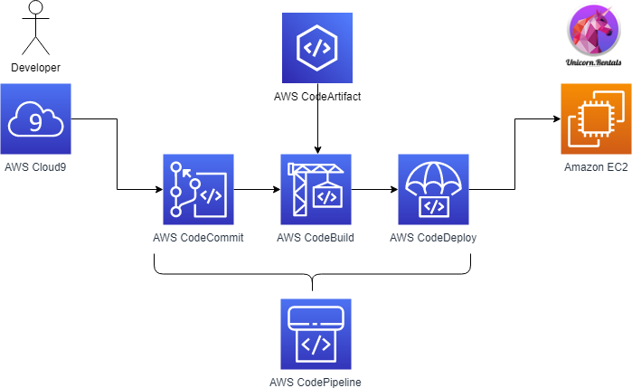
#

## The Sample Application

During this workshop we will be deploying a local customised version of the popular Unicorn Rentals application Wild Rydes.
#

#
## What you will learn

During this workshop you will experience the AWS Code services hands-on, including:

AWS CodeCommit as a Git repository
AWS CodeArtifact as a managed artifact repository
AWS CodeBuild as a way to run tests and produce software packages
AWS CodeDeploy as a software deployment service
AWS CodePipeline to create an automated CI/CD pipeline
You will experience the process of creating a CI/CD pipeline for a Java application deployed onto an EC2 Linux instance. Later you will containerize the application and publish to Amazon ECR before finally looking at the SAM CLI for Serverless CI/CD.

As a bonus, you will get hands-on experience using AWS Cloud9, a cloud-based integrated development environment (IDE) that lets you write, run, and debug your code with just a browser.
#
## Target audience

This workshop is aimed at developers, devops engineers, and technical architects looking to learn more about AWS Code services.
#
## Expected duration

This workshop will take approx 3 hours to complete. You do not need to complete all the labs, however, they should be completed in order.
#
## Running in your own AWS Account

This workshop is designed to be run at either an AWS event or in your own AWS account. No pre-created resources are required.

R3emember to run through the cleanup section once you have completed the workshop to avoid any undesired costs.
#
## Estimated costs

The services used in the workshop are mostly covered by the AWS Free Tier 

AWS CodeCommit includes 5 actives users per month for free
AWS CodeArtifact includes 2GB of storage and 100,000 requests per month for free
AWS CodeBuild includes 100 build minutes of build.general1.small per month for free
AWS CodeDeploy is free to use for EC2, Lambda and ECS deployments
AWS CodePipeline pipelines are free for the first 30 days after creation
EC2 instances used in the workshop are t2.micro which are covered for 750 hours under the AWS Free Tier each month for one year. If you are outside the first year the cost should be no more than $2 for the workshop.

Please ensure all resources are deleted at the end of the workshop using the cleanup instructions to avoid charges.
#
## Required skills

A basic understand of AWS is required including Amazon S3, Amazon EC2, AWS IAM and AWS CloudFormation.

You should also be familiar with Git, and basic Linux commands.

## Setup AWS Cloud9 IDE

AWS Cloud9 is a cloud-based integrated development environment (IDE) that lets you to write, run and debug code with just a browser. It includes a code editor, debugger, and terminal. Cloud9 comes prepackaged with essential tools for popular programming languages, so you don’t need to install files or configure your development machine to start new projects.

Throughout this workshop we will be using AWS Cloud9 to develop our application code and interact with Git.

## Launch a new Cloud9 IDE

- Log onto the AWS Console.

- Search for Cloud9 and then click Create environment.

- Name the environment UnicornIDE and give a helpful description. Click Next step.

- On the configure settings page select Create a new EC2 instance for environment. For the instance type select t2.micro and for the platform Amazon Linux 2. The remaining settings can be left as default.
#
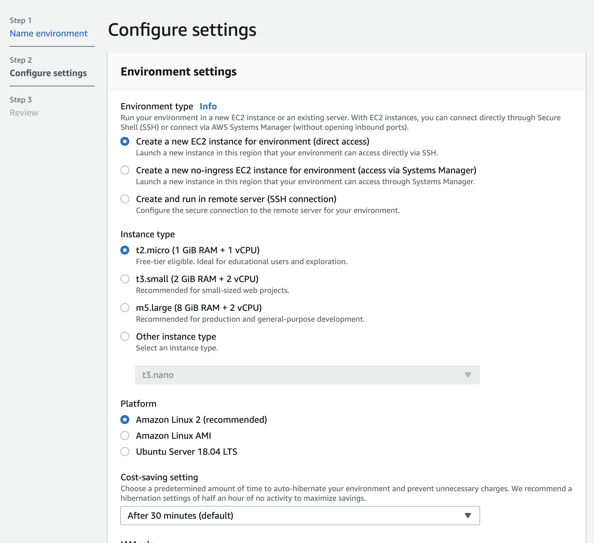
#
- Click Next step and then Create environment.

Cloud9 automatically creates a new EC2 instance in your AWS Account running the Cloud9 IDE software.

Once complete you should be presented with the Cloud9 IDE and a terminal prompt as shown below.
#
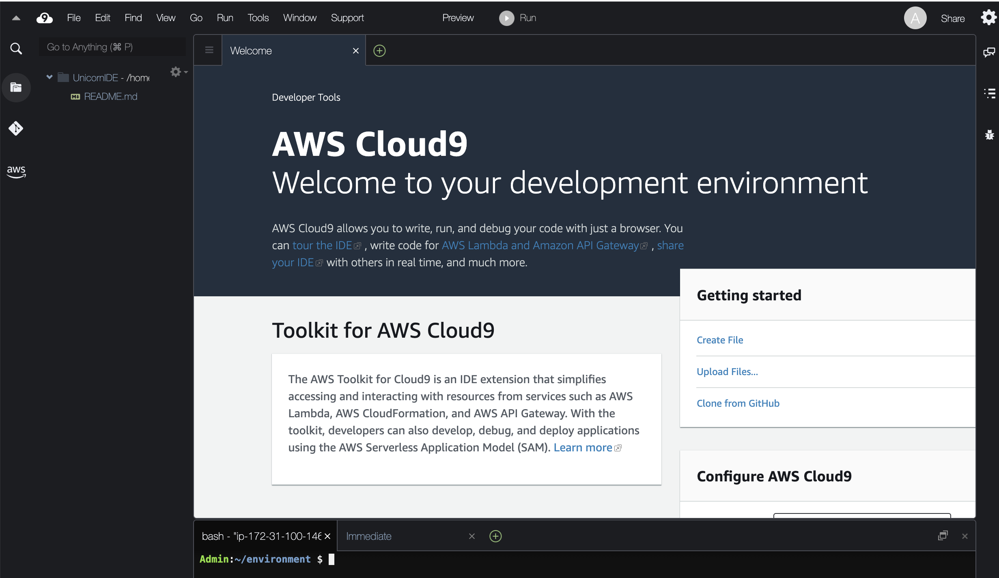
#

On the left-hand side is the file explorer and at the bottom of the screen is a terminal prompt. The Cloud9 environment already has tools such as Docker and Git installed. The awscli is also pre-configured with AWS managed temporary credentials .

Congratulations, you have setup your development environment! Let's create our application in the next lab!

## Create a web app

Now that we have our Cloud9 development environment up and running, let's create our simple Java web application.

## Install Maven & Java

Apache Maven  is a build automation tool used for Java projects. In this workshop we will use Maven to help initialize our sample application and package it into a Web Application Archive (WAR) file.

- Install Apache Maven using the commands below (enter them in the terminal prompt of Cloud9):

```bash

sudo wget https://repos.fedorapeople.org/repos/dchen/apache-maven/epel-apache-maven.repo -O /etc/yum.repos.d/epel-apache-maven.repo
sudo sed -i s/\$releasever/6/g /etc/yum.repos.d/epel-apache-maven.repo
sudo yum install -y apache-maven

```
#
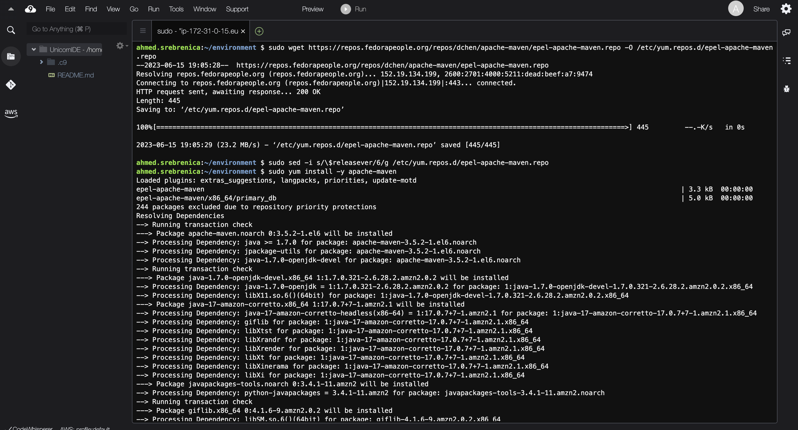
#

#

- Maven comes with Java 7. For the build image that we're going to use later on we will need to use at least Java 8. Therefore we are going to install Java 8, or more specifically Amazon Correto 8 , which is a free, production-ready distribution of the Open Java Development Kit (OpenJDK) provided by Amazon:

```bash 

sudo amazon-linux-extras enable corretto8
sudo yum install -y java-1.8.0-amazon-corretto-devel
export JAVA_HOME=/usr/lib/jvm/java-1.8.0-amazon-corretto.x86_64
export PATH=/usr/lib/jvm/java-1.8.0-amazon-corretto.x86_64/jre/bin/:$PATH

```
#
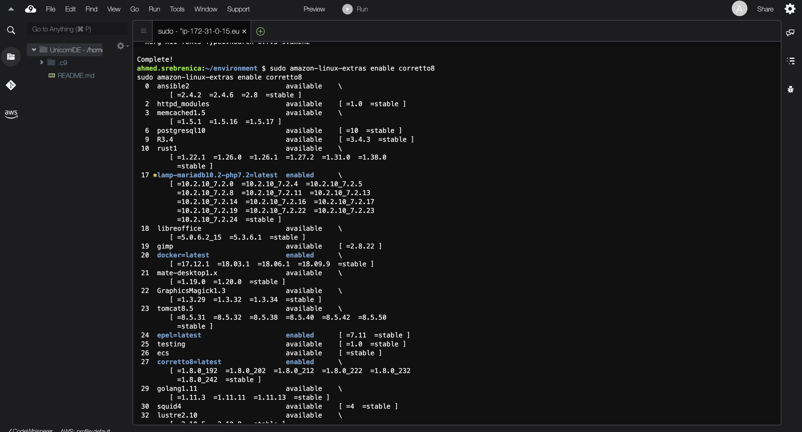
#

#
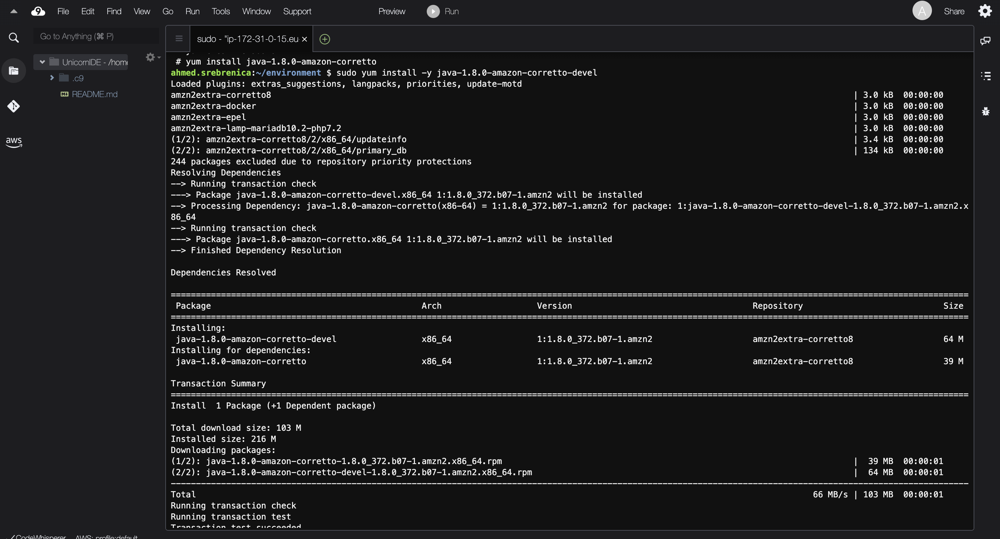
#
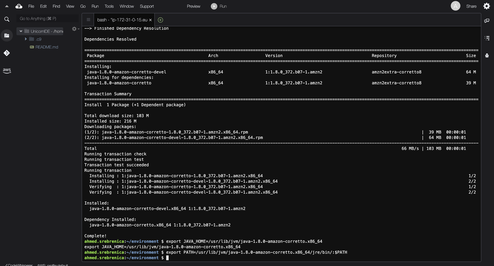
#

- Verify that Java 8 and Maven are installed correctly:

```bash

java -version
mvn -v

```
#
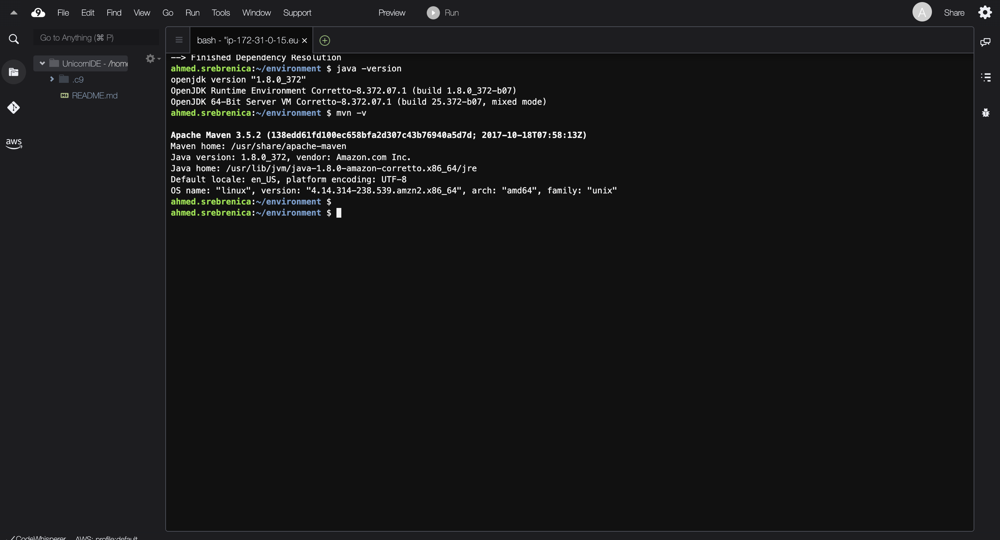

**Important**

If the command above doesn't return openjdk version 1.8 (=> Java 8), then run the following command that allows you to choose the correct Java version:

`sudo alternatives --config java`

## Create the Application

- Use mvn to generate a sample Java web app

```bash

mvn archetype:generate \
    -DgroupId=com.wildrydes.app \
    -DartifactId=unicorn-web-project \
    -DarchetypeArtifactId=maven-archetype-webapp \
    -DinteractiveMode=false

```
#
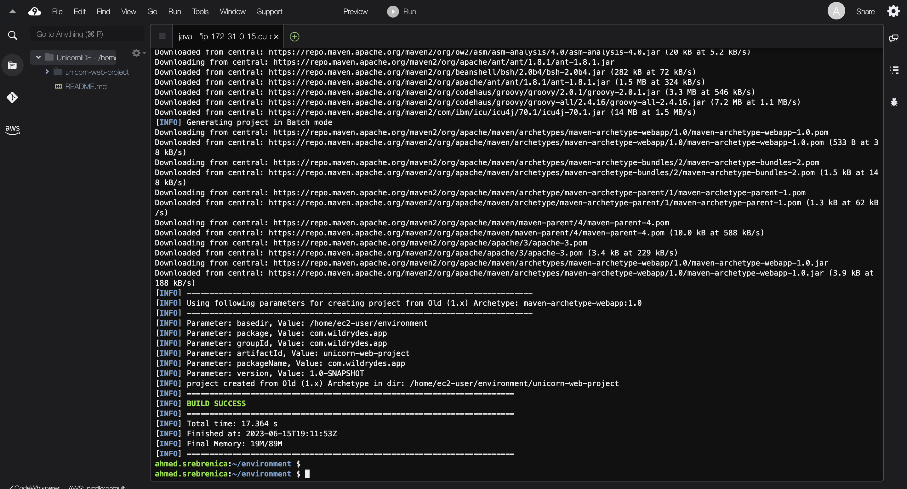
#

- Verify the folder structure has been created for the application. You should have index.jsp file and a pom.xml.

```bash

.
├── README.md
└── unicorn-web-project
    ├── pom.xml
    └── src
        └── main
            ├── resources
            └── webapp
                ├── index.jsp
                └── WEB-INF
                    └── web.xml

6 directories, 4 files

```

- Modify the index.jsp file to customize the HTML code (just to make it your own!). You can modify the file by double-clicking on it in the Cloud9 IDE. We will be modifying this further to include the full Unicorn branding later.

```bash

<html>
<body>
<h2>Hello Unicorn World!</h2>
<p>This is my first version of the Wild Rydes application!</p>
</body>
</html>

```
#
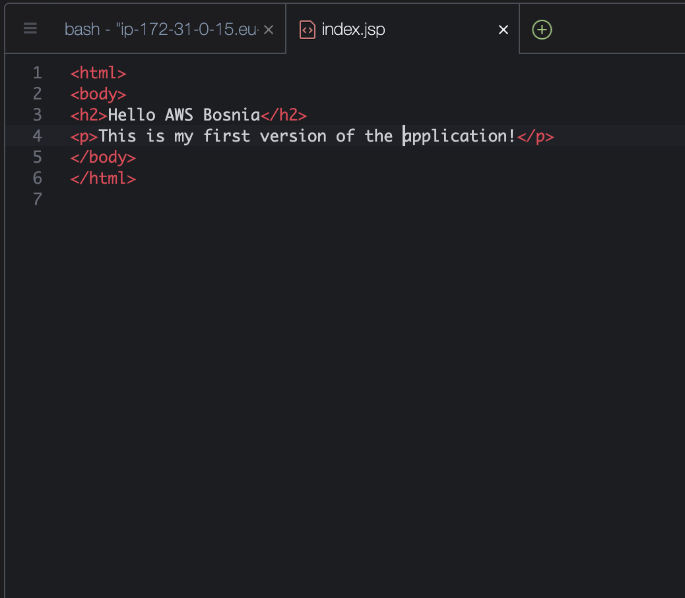
#

Great work! Now that we have some Java source code locally, let's start with the first lab, where we're going to store the source code in a Git repository. Introducing AWS CodeCommit!

# Lab 1: AWS CodeCommit


AWS CodeCommit is a secure, highly scalable, managed source control service that hosts private Git repositories. CodeCommit eliminates the need for you to manage your own source control system or about scaling its infrastructure.

In this lab we will setup a CodeCommit repository to store our Java code!

#
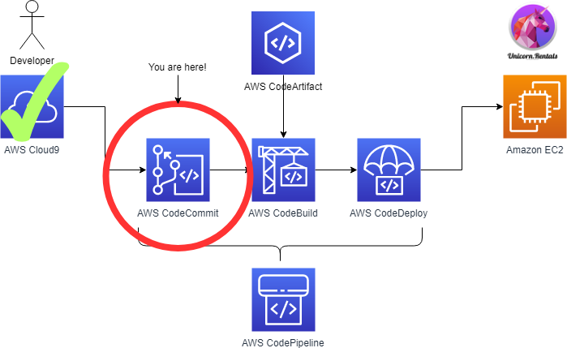
#

## Create a Repository

- Log into the AWS Console and search for the CodeCommit service.

- Click Create repository. Name it unicorn-web-project and give it a description. Also add a tag with key team and value devops.
#
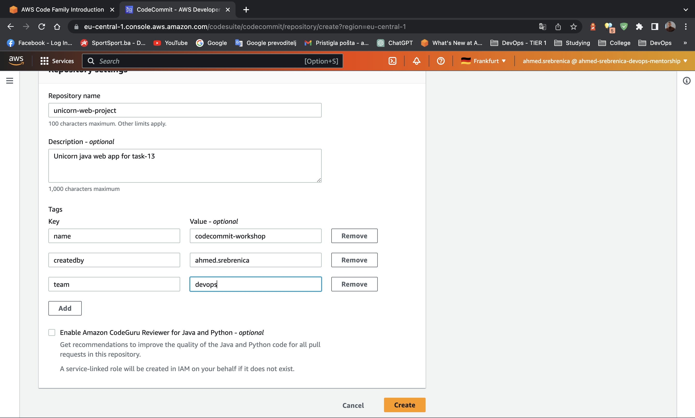
#
- Click Create.

- On the next page select Clone URL and Clone HTTPS. This will copy the repository URL to the clipboard. The URL will have the following format:

```bash

https://git-codecommit.<region>.amazonaws.com/v1/repos/<project-name>

```

Keep this URL handy for the next section.

## Commit your Code

- Back in the Cloud9 environment setup your Git identity:

```bash

git config --global user.name "<your name>"
git config --global user.email <your email>

```
#
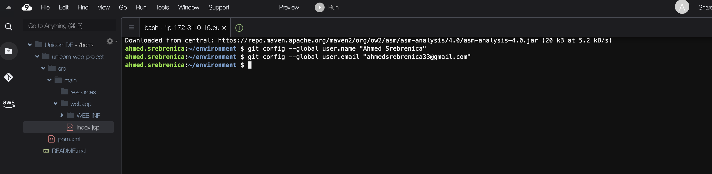
#

- Make sure you are in the ~/environment/unicorn-web-project and init the local repo and set the remote origin to the CodeCommit URL you copied earlier:

```bash

cd ~/environment/unicorn-web-project
git init -b main
git remote add origin <HTTPS CodeCommit repo URL>

```
#
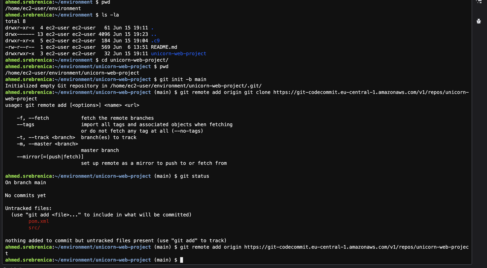
#

- Now we can commit and push our code!

```bash

git add *
git commit -m "Initial commit"
git push -u origin main

```
#
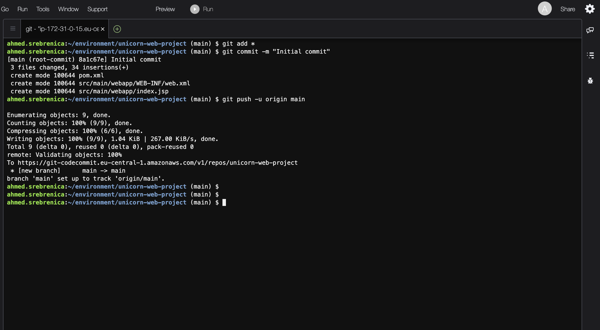
#

- You should now be able to refresh the CodeCommit page in the AWS Console and see the newly created files.
#
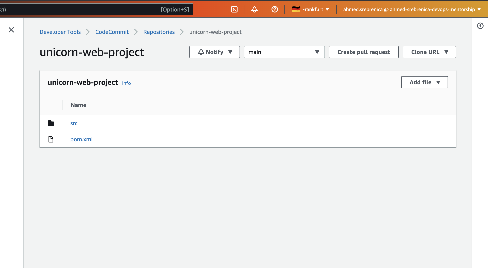
#

Nice work! Now we have a working CodeCommit repository to store and version control our code! Next, we need a way to fetch the packages to produce our Java WAR file. Introducing AWS CodeArtifact!

# Lab 2: AWS CodeArtifact

AWS CodeArtifact is a fully managed artifact repository service that makes it easy for organizations of any size to securely fetch, store, publish, and share software packages used in their software development process.

In this lab we will setup a CodeArtifact repository that we will be using during the build phase with CodeBuild to fetch Maven packages from a public package repository (the "Maven Central Repository"). Using CodeArtifact rather than the public repository directly has several advantages, including improved security, as you can strictly define which packages can be used. To see other advantages of using CodeArtifact, please refer to the AWS CodeArtifact features  web page.

Within this workshop, we will use CodeArtifact as a simple package cache. This way, even if the public package repository would become unavailable, we could still build our application. In real-world scenarios this can be an important requirement to mitigate the risk that an outage of the public repository can break the complete CI/CD pipeline. Furthermore, it helps to ensure that packages, which your project depends on, and which are (accidentally, or on purpose) being removed from the public package repository, don't break the CI/CD pipeline (as they are still available via CodeArtifact in that case).

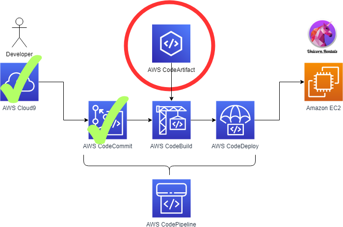

## Create Domain and Repository

- Log into the AWS Console and search for the CodeArtifact service.

- Choose Domains in the menu on the left, then Create domain. Name it unicorns and choose "Create domain" to finish the domain setup.
#
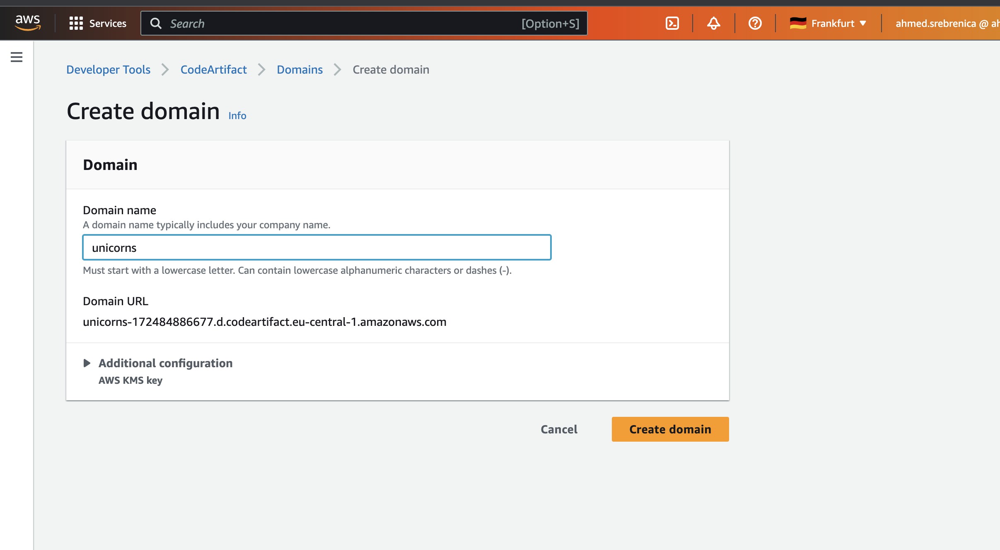
#

- Now, choose Create repository to create a repository for this new domain. Name it unicorn-packages and give it a description. Select maven-central-store as public upstream repository and click Next.
#
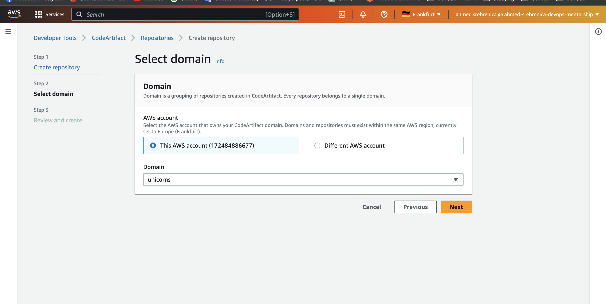
#

#

- Review the settings. Especially keep note of the Package flow section that visualizes how there will be two repositories created as part of the process: the actual unicorn-packages repository, as well as an upstream repository (maven-central-store), which serves as an intermediate between the public repository. Click Create repository to finish the process.
#
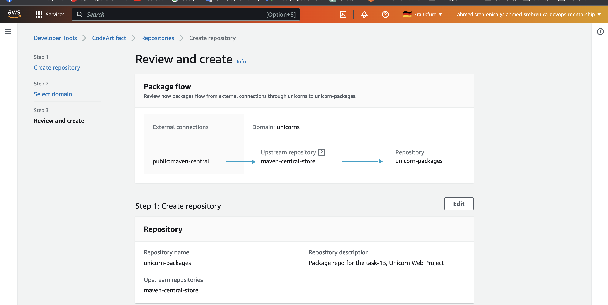
#

## Connect the CodeArtifact repository

- On the next page, click View connection instructions. In the dialog, choose Mac & Linux for Operating system and mvn as package manager.
#
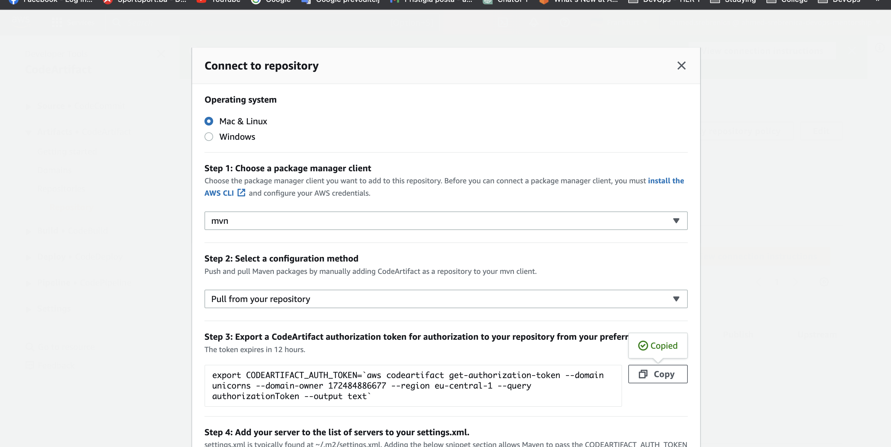
#

- Copy the command for the authorization token and run it in your Cloud9 command prompt. This will look similar to the below. Be sure to adjust the domain-owner and, if present, the region to your account ID and region, respectively.

```bash

export CODEARTIFACT_AUTH_TOKEN=`aws codeartifact get-authorization-token --domain unicorns --domain-owner 123456789012 --query authorizationToken --output text`

```
#
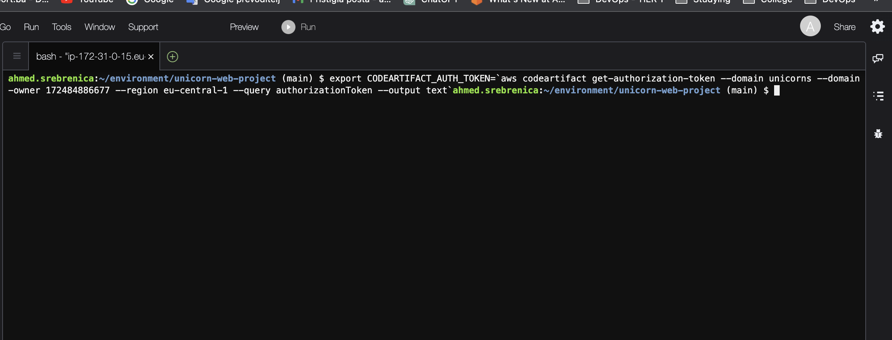
#

- For the next steps, we'll have to update the settings.xml. As this doesn't exist yet, let's create it first:

```bash

cd ~/environment/unicorn-web-project
echo $'<settings>\n</settings>' > settings.xml 

```
#

#

- Open the newly created settings.xml in the Cloud9 directory tree and follow the remaining steps in the Connection instructions dialog in the CodeArtifact console including the mirror section. The complete file will look similar to the one below. Close the dialog when finished by clicking Done.

**Important:** Do NOT copy/paste the content below into your settings.xml as this is just to illustrate the structure - your own settings.xml will use different URLs, which you need to copy from the CodeArtifact dialog.

```bash

<settings>
    <profiles>
        <profile>
            <id>unicorns-unicorn-packages</id>
            <activation>
                <activeByDefault>true</activeByDefault>
            </activation>
            <repositories>
                <repository>
                    <id>unicorns-unicorn-packages</id>
                    <url>https://unicorns-123456789012.d.codeartifact.us-east-2.amazonaws.com/maven/unicorn-packages/</url>
                </repository>
            </repositories>
        </profile>
    </profiles>
    <servers>
        <server>
            <id>unicorns-unicorn-packages</id>
            <username>aws</username>
            <password>${env.CODEARTIFACT_AUTH_TOKEN}</password>
        </server>
    </servers>
    <mirrors>
        <mirror>
            <id>unicorns-unicorn-packages</id>
            <name>unicorns-unicorn-packages</name>
            <url>https://unicorns-123456789012.d.codeartifact.us-east-2.amazonaws.com/maven/unicorn-packages/</url>
            <mirrorOf>*</mirrorOf>
        </mirror>
    </mirrors>
</settings>

```
#

#

## Testing via Cloud9

- Let's verify if the application can be compiled successfully locally in Cloud9 using the settings file:

```bash

mvn -s settings.xml compile

```
#

#

#

- If the build was successful, go back to the CodeArtifact console and refresh the page of the unicorn-packages repository. You should now see the packages that were used during the build in the artifact repository. This means that they were downloaded from the public repository and are now available as a copy inside CodeArtifact.
#
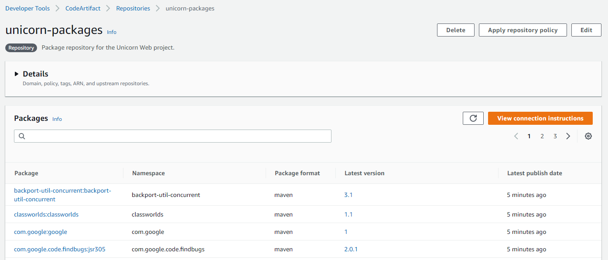
#

## IAM Policy for consuming CodeArtifact

Before moving on to the next lab, let's define an IAM policy so that other services can consume our newly created CodeArtifact repository.

- In the AWS Console, search for IAM, select it, and click Policies in the menu on the left.

- Click Create policy and select the JSON tab on top to view the raw JSON code of the IAM policy, then copy/paste the policy code below (source: Using Maven packages in CodeBuild ). This will make sure that other services such as CodeBuild will be able to read the packages in our CodeArtifact repository.

- Click Next: Tags and Next: Review.

- Name the policy codeartifact-unicorn-consumer-policy and provide a meaningful description such as "Provides permissions to read from CodeArtifact".

- Click Create policy.
#
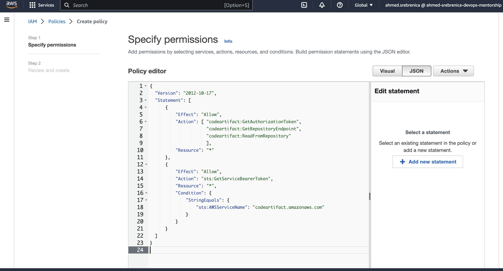
#
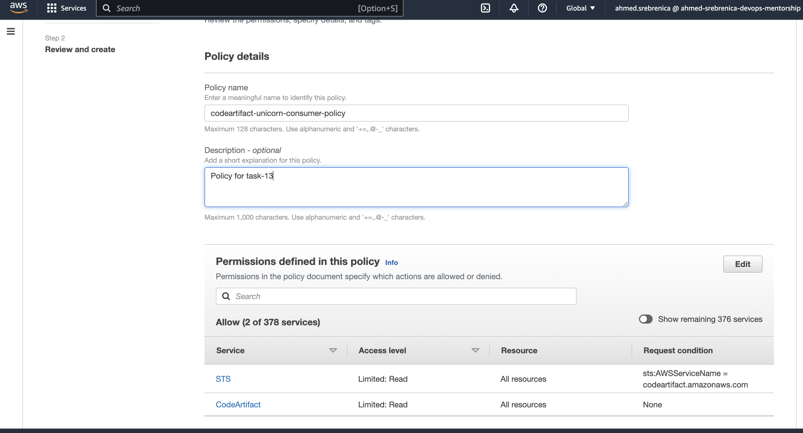
#
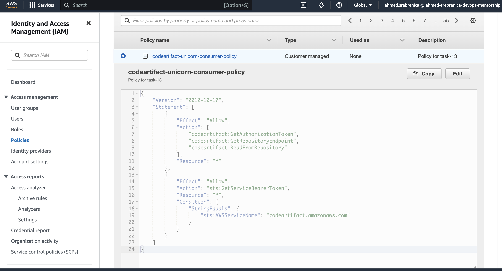
#

Nice work! We now have our working repositories which can be consumed by other services. Next, we need a way to compile our code from within AWS to produce our Java WAR file. Introducing AWS CodeBuild!

# Lab 3: AWS CodeBuild

AWS CodeBuild is a fully managed continuous integration service that compiles source code, runs tests, and produces software packages that are ready to deploy. You can get started quickly with prepackaged build environments, or you can create custom build environments that use your own build tools.

In this lab we will setup a CodeBuild project to package our application code into a Java Web Application Archive (WAR) file.
#

#

## Create an S3 bucket

We first need to create an S3 bucket which will be used to store the output from CodeBuild i.e. our WAR file!

- Log into the AWS Console and search for the S3 service.

- Click Create Bucket and give the bucket a unique name e.g. unicorn-build-artifacts-12345.

- Leave all other options as default and click Create bucket.

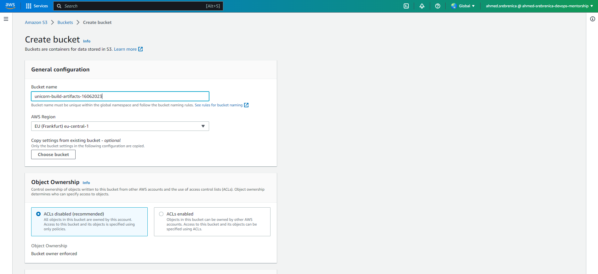

## Create a CodeBuild build project

- Log into the AWS Console and search for the CodeBuild service.

- Under build projects select Create build project.

- Name the project unicorn-web-build and set a helpful description. Below Additional configuration, add a tag with key team and value devops.
#
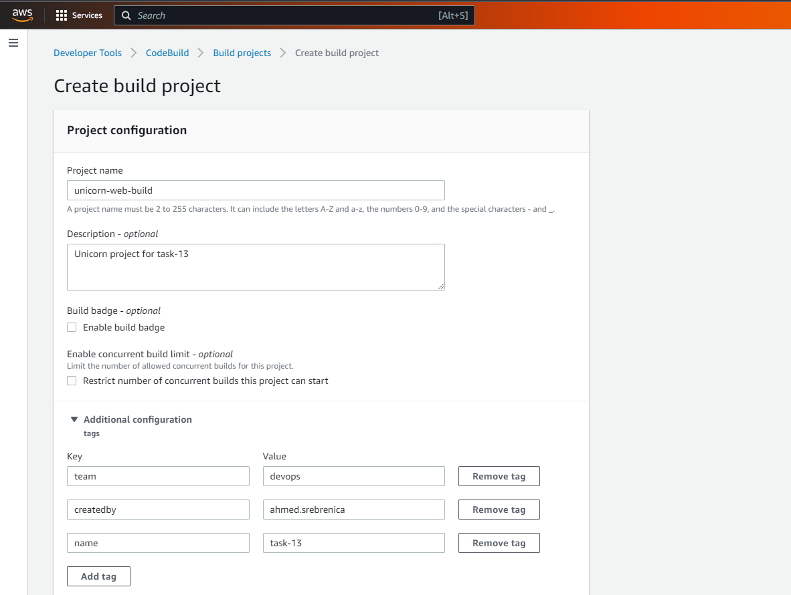
#

- Under source select AWS CodeCommit as the source provider and select the unicorn-web-project as the repository. The branch should be main with no Commit ID. 
#
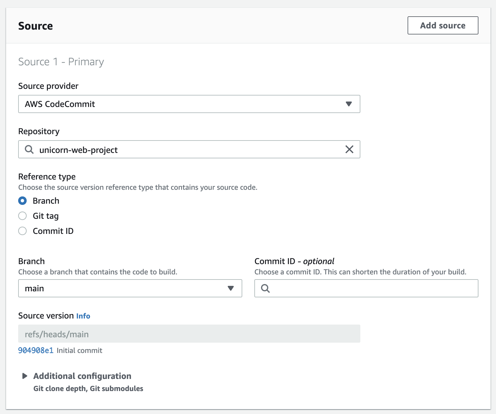
#

- Under environment choose to use a Managed image and select the following:

Operating System = Amazon Linux 2
Runtime = Standard
Image = aws/codebuild/amazonlinux2-x86_64-standard:3.0
Image version = Always use the latest image for this runtime version
Environment Type = Linux
#
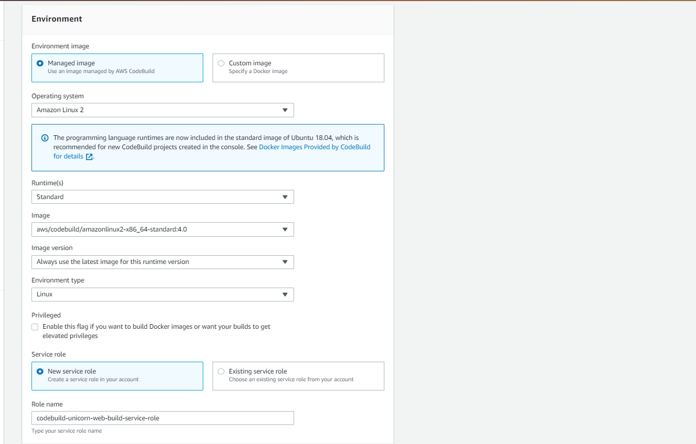
#

- Under Buildspec leave the default option to Use a buildspec file which will look for a config file called buildspec.yml (we will create this later).

- Under Artifacts select Amazon S3 and choose the bucket name created earlier. Set the name to unicorn-web-build.zip. Leave the other options as default ensuring the artifact packaging is set to Zip.

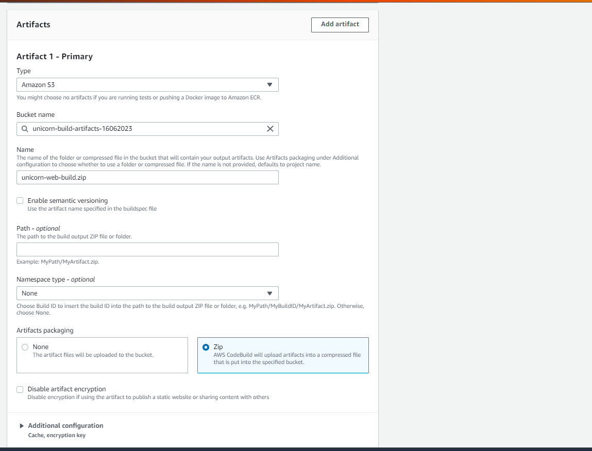

- Finally, under Logs enable CloudWatch logs if it's not enabled yet. Set the group name to unicorn-build-logs and the stream name to webapp. This will allow us to track the output of our build in CloudWatch Logs.

- Click create build project to finish!

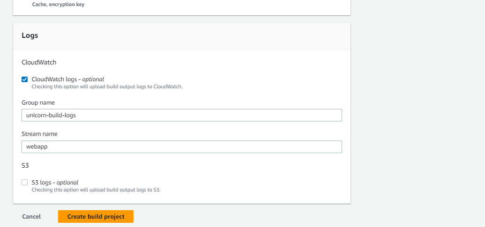

## Create the buildspec.yml file

Now we have our build project setup we need to give it some instructions on how to build our application. To do this we will create a buildspec.yml (YAML) file in the root of the code repository.

- Log back into the Cloud9 IDE.

- Under the ~/environment/unicorn-web-project/ folder create a new file called buildspec.yml (naming must be exact!) and copy in the below contents. Make sure to replace the domain-owner account ID with your own account ID.

```bash

version: 0.2

phases:
  install:
    runtime-versions:
      java: corretto8
  pre_build:
    commands:
      - echo Initializing environment
      - export CODEARTIFACT_AUTH_TOKEN=`aws codeartifact get-authorization-token --domain unicorns --domain-owner 123456789012 --query authorizationToken --output text`
  build:
    commands:
      - echo Build started on `date`
      - mvn -s settings.xml compile
  post_build:
    commands:
      - echo Build completed on `date`
      - mvn -s settings.xml package
artifacts:
  files:
    - target/unicorn-web-project.war
  discard-paths: no


```

#
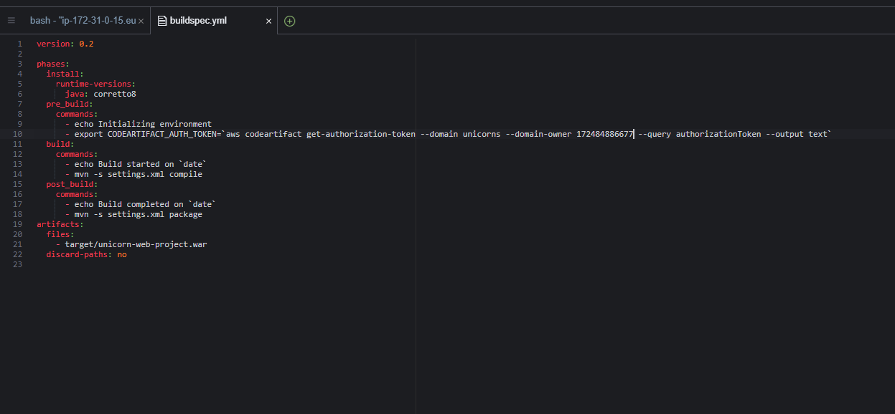
**Change the version from 8 to 17.**
#

- Save the buildspec.yml file. Then commit and push it to CodeCommit.

```bash

cd ~/environment/unicorn-web-project
git add *
git commit -m "Adding buildspec.yml file"
git push -u origin main

```

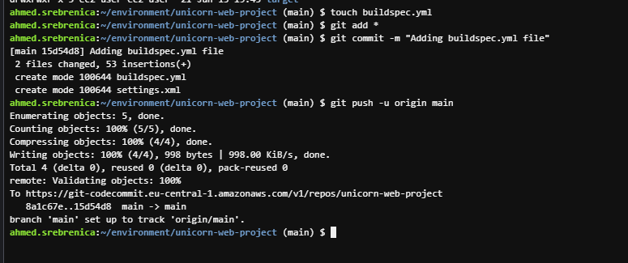

## Modifying the IAM role

As we're using CodeArtifact during the build phase, there is a small change required in the previously auto-generated IAM role to ensure it has permissions to use CodeArtifact. For this, we will use the IAM policy that was created in the earlier lab.

- In the AWS Console, search for IAM and select Roles in the menu on the left.

- Search for codebuild-unicorn-web-build-service-role to locate the auto-generated role and click it.

- Click the Add permissions button and select Attach policies in the drop-down menu.

- Search for codeartifact-unicorn-consumer-policy, select the item, and click Attach policies.
#
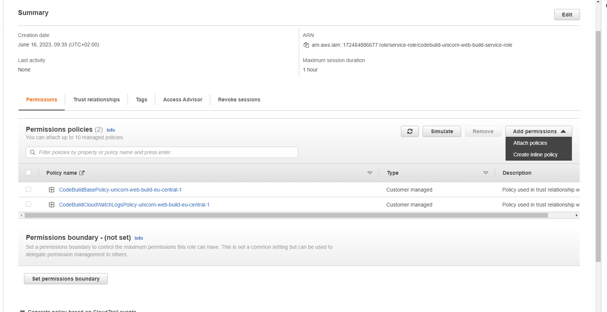
#
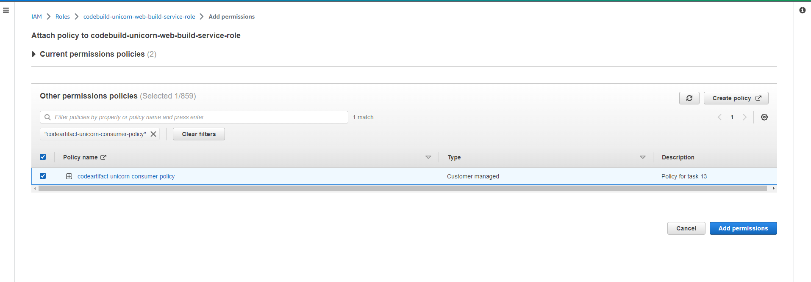
#
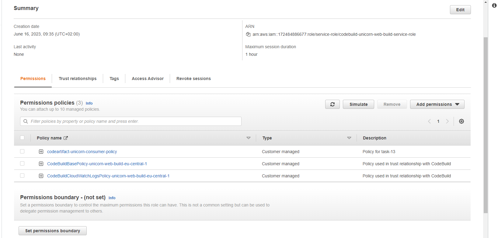
#

## Testing the build project

Now we have everything in place to run our first build using CodeBuild!

- In the AWS Console search for CodeBuild service.

- Select the unicorn-web-build project and select Start build > Start now.

- Monitor the logs and wait for the build status to complete (this should take no more than 5 minutes):
#
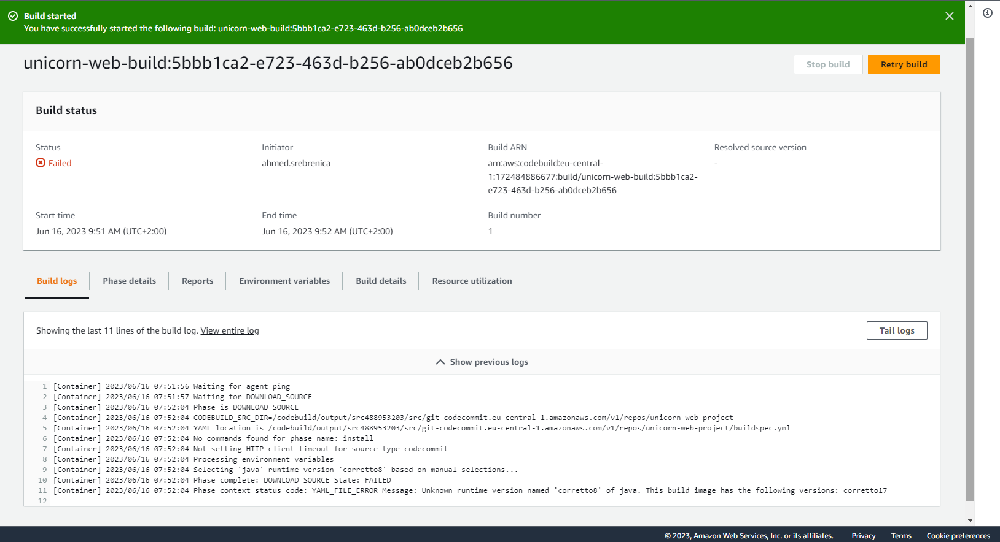
#

#
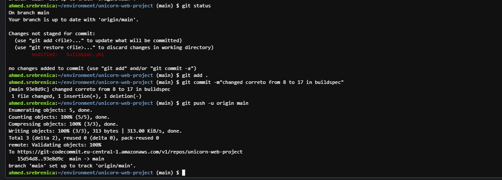
#
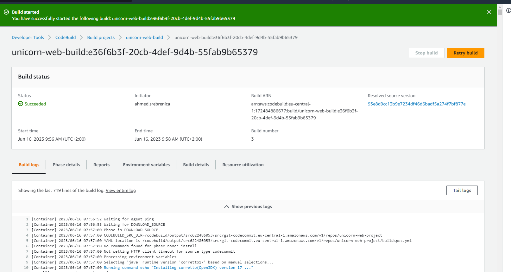
#

- Finally browse to your artifact S3 bucket to verify you have a packaged WAR file inside a zip named unicorn-web-project.zip:
#
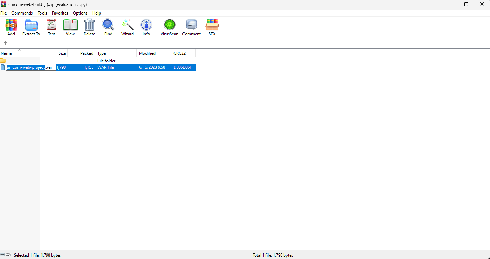
#

Amazing work! We now have a code and artifact repository, and a solution to compile our application. It's a manually triggered build at the moment which will fix later. But at least we know our builds are completed in a consistent manner.

Next, we will look into how to host and deploy our packaged WAR file with AWS CodeDeploy!

# Lab 4: AWS CodeDeploy

AWS CodeDeploy is a fully managed deployment service that automates software deployments to a variety of compute services such as Amazon EC2, AWS Fargate, AWS Lambda, and even on-premise services. You can use AWS CodeDeploy to automate software deployments, eliminating the need for error-prone manual operations.

In this lab, we will use CodeDeploy to install our Java WAR package onto an Amazon EC2 instance running Apache Tomcat .
#
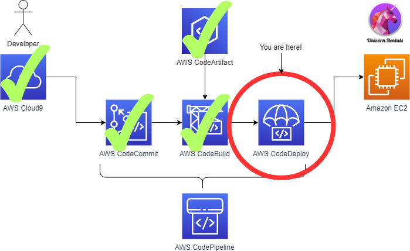
#

## Create an EC2 instance

- We are going to use AWS CloudFormation to provision a VPC and an EC2 instance to deploy our application to.

- Log into the AWS Console and search for CloudFormation.

- Download the provided CloudFormation YAML Template .

- In the CloudFormation Console, click Create stack > with new resources (standard).

- Select Upload a template file and click Choose file. Select the yaml file downloaded in step 2 and click Next.


- Name the stack UnicornStack and provide your IP address from http://checkip.amazonaws.com/  in the format 1.2.3.4/32 when prompted. Click through next accepting all the remaining defaults. Remember to acknowledge the IAM resources checkbox before clicking Create stack.

- Wait for the stack to complete. This should take no longer than 5 minutes.

#
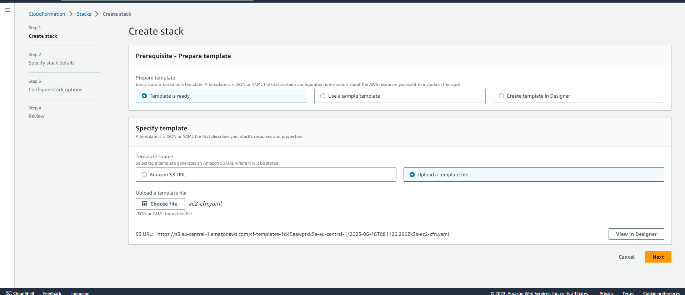
#
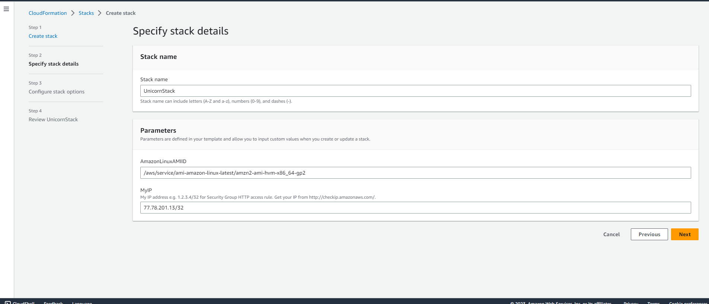
#
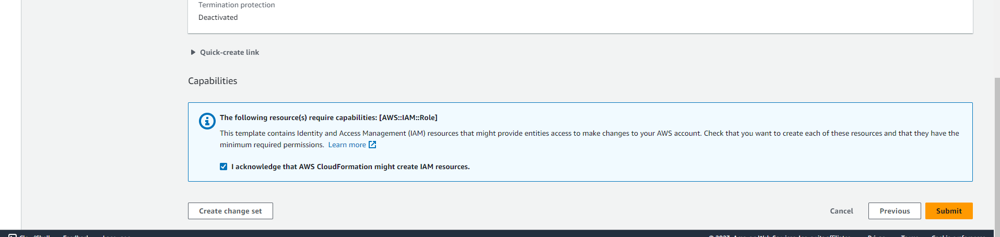
#
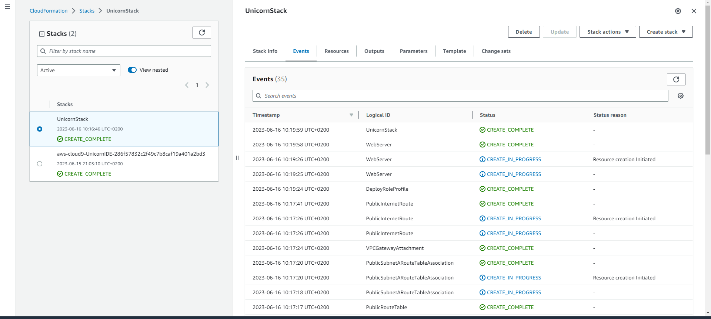
#

- Once successful, search for "EC2" in the AWS Console and click on Instances (running). You should see once instance named UnicornStack::WebServer.

#
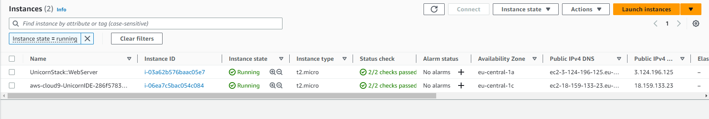
#

## Create scripts to run the application

Next, we need to create some bash scripts in our Git repository. CodeDeploy uses these scripts to setup and deploy the application on the target EC2 instance.

- Log into the Cloud9 IDE.

- Create a new folder scripts under ~/environment/unicorn-web-project/ .

- Create a file install_dependencies.sh file in the scripts folder and add the following lines:

```bash 

#!/bin/bash
sudo yum install tomcat -y
sudo yum -y install httpd
sudo cat << EOF > /etc/httpd/conf.d/tomcat_manager.conf
<VirtualHost *:80>
    ServerAdmin root@localhost
    ServerName app.wildrydes.com
    DefaultType text/html
    ProxyRequests off
    ProxyPreserveHost On
    ProxyPass / http://localhost:8080/unicorn-web-project/
    ProxyPassReverse / http://localhost:8080/unicorn-web-project/
</VirtualHost>
EOF

```

- Create a start_server.sh file in the scripts folder and add the following lines:

```bash 

#!/bin/bash
sudo systemctl start tomcat.service
sudo systemctl enable tomcat.service
sudo systemctl start httpd.service
sudo systemctl enable httpd.service

```

- Create a stop_server.sh file in the scripts folder and add the following lines:

```bash

#!/bin/bash
isExistApp="$(pgrep httpd)"
if [[ -n $isExistApp ]]; then
sudo systemctl stop httpd.service
fi
isExistApp="$(pgrep tomcat)"
if [[ -n $isExistApp ]]; then
sudo systemctl stop tomcat.service
fi

```
#
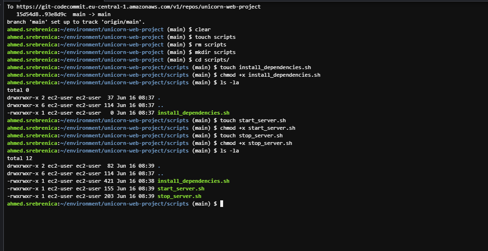
#

- CodeDeploy uses an application specification (AppSpec) file in YAML to specify what actions to take during a deployment, and to define which files from the source are placed where at the target destination. The AppSpec file must be named appspec.yml and placed in the root directory of the source code.

Create a new file appspec.yml in the ~/environment/unicorn-web-project/ folder and add the following lines:

```bash

version: 0.0
os: linux
files:
  - source: /target/unicorn-web-project.war
    destination: /usr/share/tomcat/webapps/
hooks:
  BeforeInstall:
    - location: scripts/install_dependencies.sh
      timeout: 300
      runas: root
  ApplicationStart:
    - location: scripts/start_server.sh
      timeout: 300
      runas: root
  ApplicationStop:
    - location: scripts/stop_server.sh
      timeout: 300
      runas: root

```
#
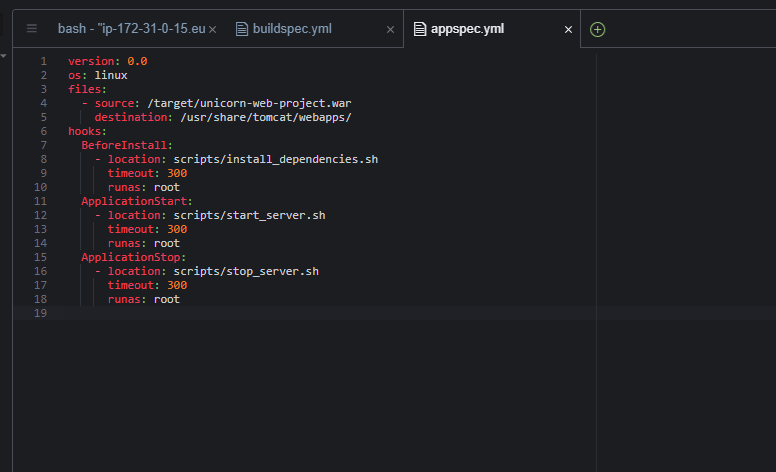
#

To ensure that that the newly added scripts folder and appspec.yml file are available to CodeDeploy, we need to add them to the zip file that CodeBuild creates. This is done by modifying the artifacts section in the buildspec.yml like shown below:

```bash

phases:
  [..]
  
artifacts:
  files:
    - target/unicorn-web-project.war
    - appspec.yml
    - scripts/**/*
  discard-paths: no

```
#
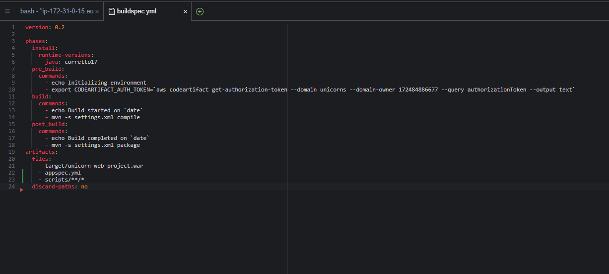
#

- Now commit all the changes to CodeCommit:

```bash

cd ~/environment/unicorn-web-project
git add *
git commit -m "Adding CodeDeploy files"
git push -u origin main

```
#
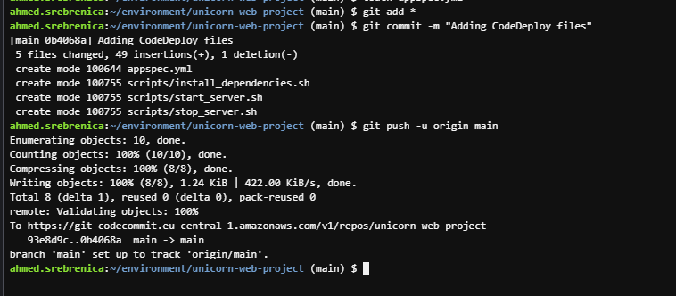
#

- Log into the CodeBuild Console and click on Start build to run the unicorn-web-build project again which will include our newly added artifacts in the zip package.

#
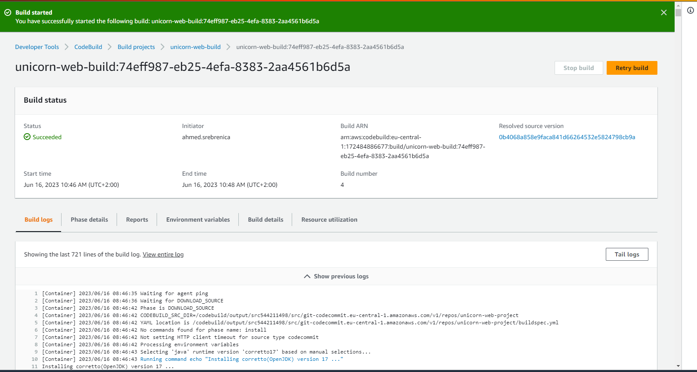
#

## Create CodeBuild service IAM Role

CodeDeploy requires a service role to grant it permissions to the desired compute platform. For EC2/On-Premises deployments you can use the AWS Managed AWSCodeDeployRole policy.

- Log into the AWS Console and open the IAM console.

- Choose Roles and then click Create role.

- Choose CodeDeploy as the service and then select CodeDeploy for the use case. Click Next.

#
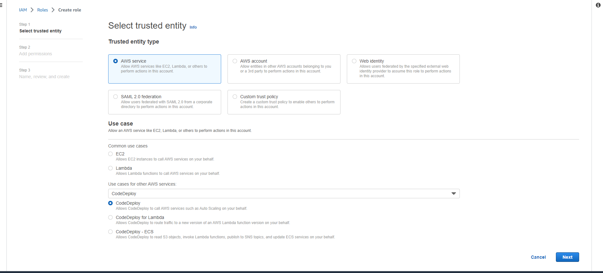
#

- Accept the AWSCodeDeployRole default policy. Don't forget to take a look at the permissions this grants - in production you will want to be more granular!

#
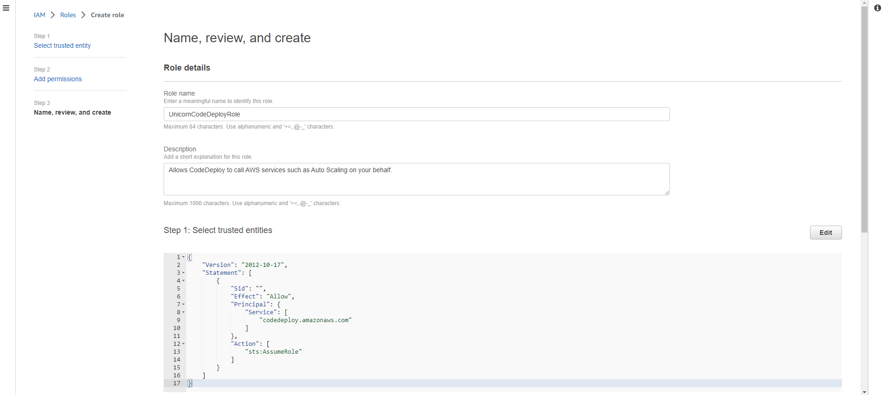
#

- Click Next and name the role UnicornCodeDeployRole. Click Create role to finish.

## Create a CodeDeploy application

Now that we have our required files in place, let's create a CodeDeploy application. An application is simply a name or container used by CodeDeploy to ensure that the correct revision, deployment configuration, and deployment group are referenced during a deployment.

- Log into the AWS Console and search for CodeDeploy.

- Click on Applications on the left-hand menu and select Create application.

- Name the application unicorn-web-deploy and select EC2/On-premises as the Compute platform. Note the other options for AWS Lambda and Amazon ECS. Click Create application.

#
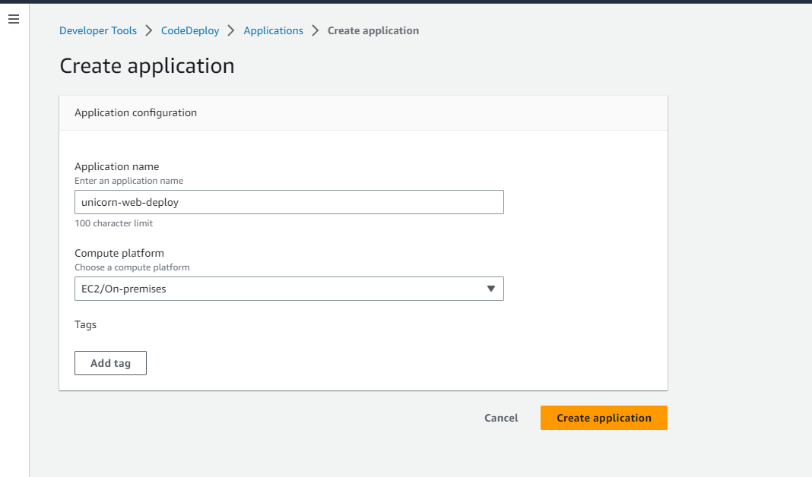
#


## Create a deployment group

Next, let's create a deployment group, which contains settings and configurations used during the deployment. It defines for example that our deployment shall target any EC2 instances with a specific tag.

- Under the unicorn-web-deploy application in the Deployment groups tab click Create deployment group.

- Configure the following options:

Name = unicorn-web-deploy-group
Service role = arn:aws:iam::<aws-account-id>:role/UnicornCodeDeployRole
Deployment type = In-place
Environment configuration = Amazon EC2 instances
Tag group 1 Key = role
Tag group 1 Value = webserver
Install AWS CodeDeploy Agent = Now and schedule updates (14 days)
Deployment settings = CodeDeployDefault.AllAtOnce
Load balancer = Uncheck Enable load balancing (we just have one server)

#
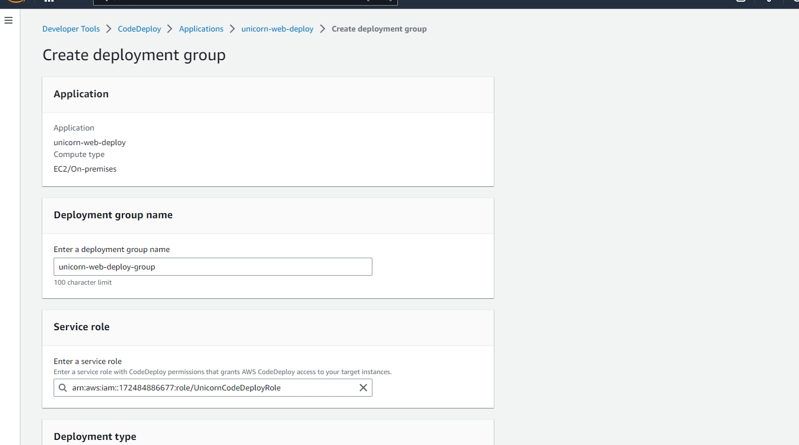
#
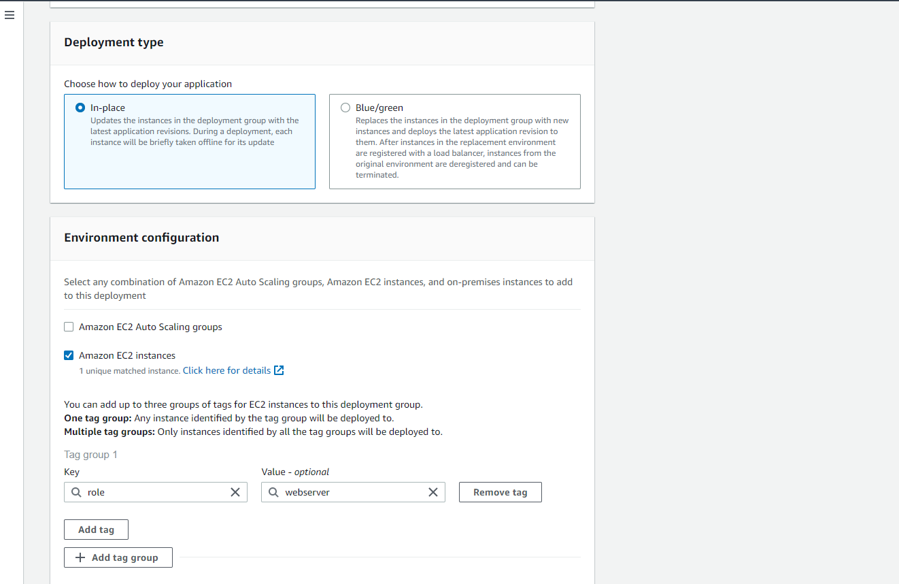
#
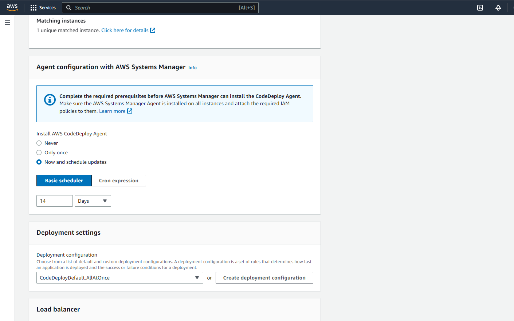
#
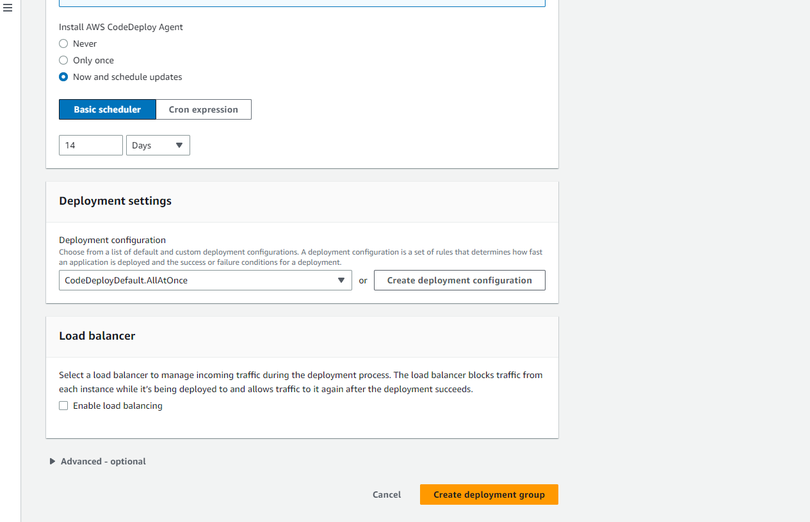
#

- Click Create deployment group.

## Create deployment

After creating our deployment group, i.e. defining the resources that we want to deploy, we can now create a deployment!

- In the unicorn-web-deploy-group click Create deployment.

- For the revision location use the S3 bucket created earlier:

```bash

s3://<my-artifact-bucket-name>/unicorn-web-build.zip

```
- Select the revision file type as .zip.

#
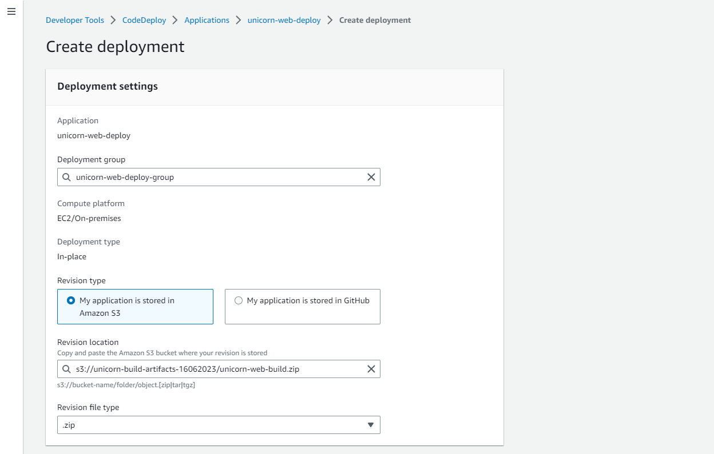
#

- Leave the other settings as default and click Create deployment.

- The deployment will now begin. Keep an eye on the deployment lifecycle events and check it completes successfully.

#

#

#

- Finally check that the web application is working by browsing to http://<public-ip-address>. You can get the public IP address from the instance details Networking tab. Remember that if you click the open address link this will default to https and needs to be changed to http.

#
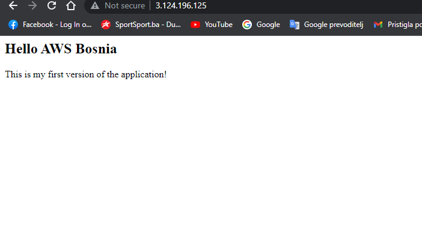
#

Nice! We have a working web application! Don't worry, we will jazz the content up later on.

We now have a way to build and deploy our application, but currently both jobs are triggered manually. It would be much better if we automated the whole process triggered by a change to CodeCommit. Introducing AWS CodePipeline!

# Lab 5: AWS CodePipeline

AWS CodePipeline is a fully managed continuous delivery service that helps you automate your release pipelines for fast and reliable application and infrastructure updates. You only pay for what you use.

In this lab we use CodePipeline to create an automated pipeline using the CodeCommit, CodeBuild and CodeDeploy components created earlier. The pipeline will be triggered when a new commit is pushed to the main branch of our Git repo.

#
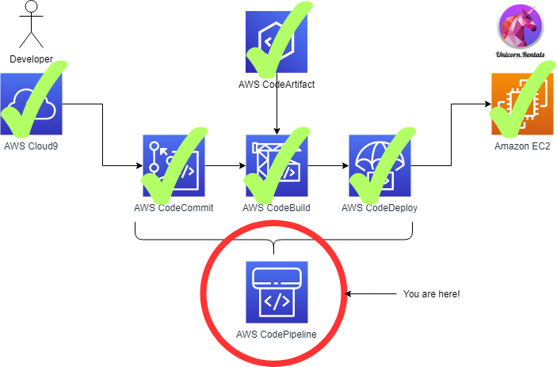
#

## Create the pipeline

- Log into the AWS Console and search for the CodePipeline service.

- Under Pipelines choose Create pipeline.

- Enter unicorn-web-pipeline as the pipeline name. Choose to create a new service role and use the auto generated name. Leave other settings as default and click Next.

#
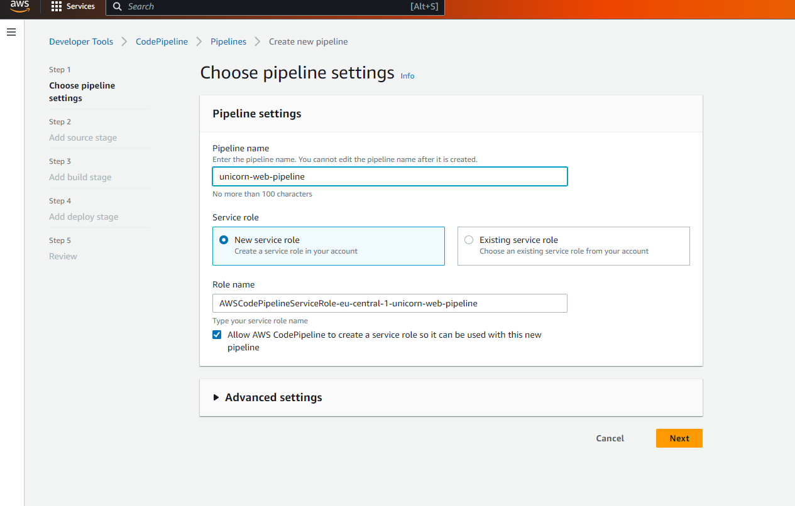
#

- Under the source provider select AWS CodeCommit and select the unicorn-web-project as the repository. Set the branch name to be main. Leave the detection option as Amazon CloudWatch Events and the output artifact format to be CodePipeline default. Click Next.

#
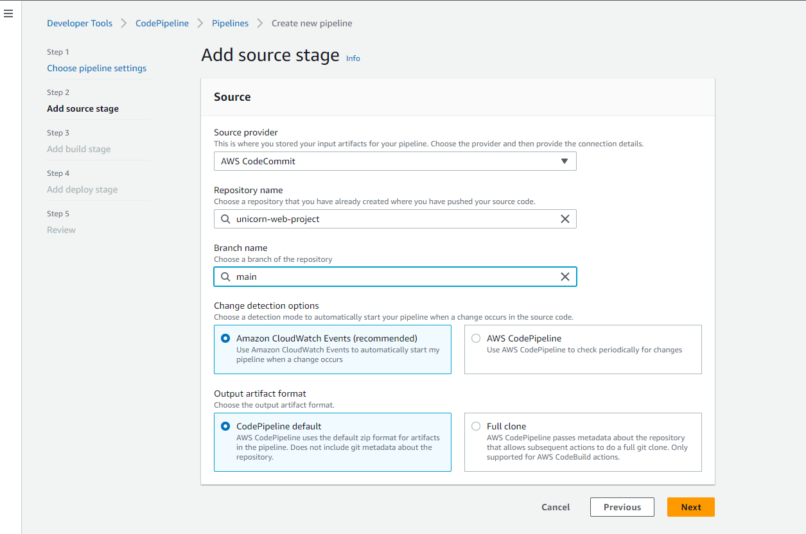
#

- On the build stage screen select AWS CodeBuild as the build provider and unicorn-web-build as the project name. Leave the build type as Single build. Click Next.

#
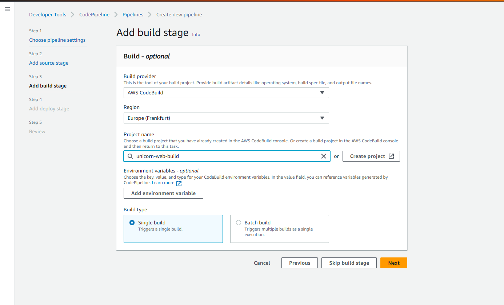
#

- On the deploy stage screen select AWS CodeDeploy as the deploy provider and unicorn-web-deploy as the application name. Select unicorn-web-deploy-group as the deployment group. Click Next.

#
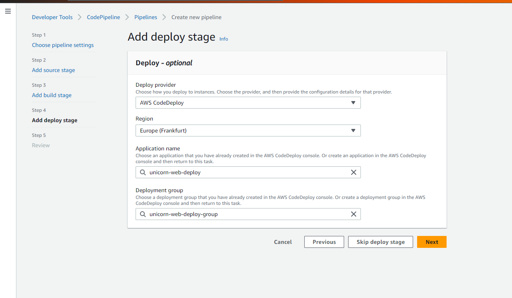
#

- Review the pipeline settings and click Create pipeline. Once you click create, the whole pipeline will run for the first time. Ensure it completes successfully (this may take a few minutes).

#
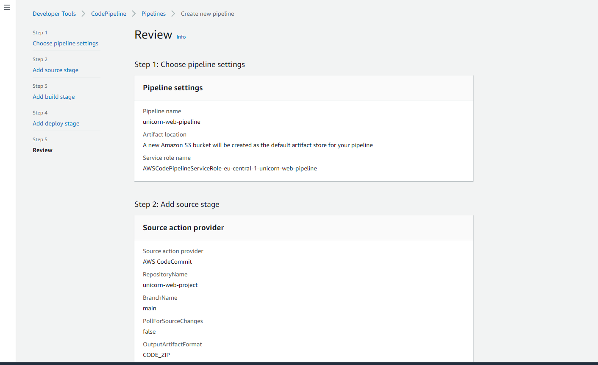
#
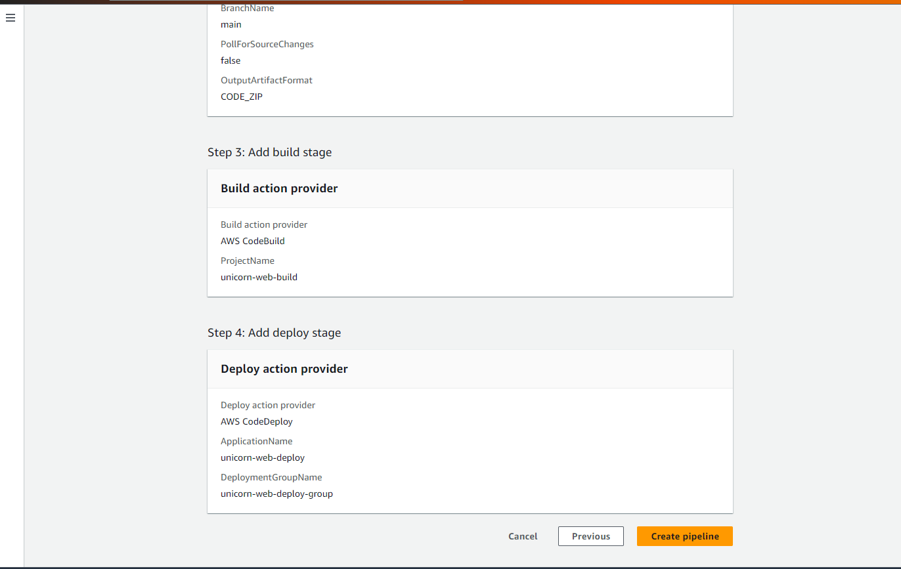
#

## Release a change

Congratulations, you now have a fully managed CI/CD pipeline! Let's test if everything is working.

- Log back into your Cloud9 environment.

- Update the index.jsp with the below html:

```bash

<!doctype html>

<html lang="en">
<head>
  <meta charset="utf-8">
  <style>
    body{
        font-family:'Segoe UI', Tahoma, Geneva, Verdana, sans-serif;
    }
    .site-header .title{
        background: url(images/wr-home-top.jpg) no-repeat top;
        background-size: cover;
        padding-bottom: 70.2753441802%;
        margin: 0;
        text-indent: -999em;
        position: relative;
    }
    .home-about {
        background: #f50856;
        color: #fff;
        padding: 5rem 0;
        text-align: center;
    }
    </style>
  <title>Wild Rydes</title>
</head>

<body>
    <header class="site-header">
        <h1 class="title">Wild Rydes</h1>
    </header>
    <section class="home-about">
        
        <h2 class="section-title">How Does This Work?</h2>
        <p class="content">
            In today's fast paced world, you've got places you need to be but not enough time in your jam packed schedule. Wouldn't it be nice if there were a transportation service that changed the way you get around daily? Introducing Wild Rydes, an innovative transportation service that helps people get to their destination faster and hassle-free. Getting started is as easy as tapping a button in our app.
        </p>
        <h2 class="section-title">Our Story</h2>
      <p class="content">
        Wild Rydes was started by a former hedge fund analyst and a software developer. The two long-time friends happened upon the Wild Rydes idea after attending a silent yoga retreat in Nevada. After gazing upon the majestic herds of unicorns prancing across a surreal Nevada sunset, they witnessed firsthand the poverty and unemployment endemic to that once proud race. Whether it was modern society's reliance on science over magic or not, we'll never know the cause of their Ozymandian downfall and fade to obscurity. Moved by empathy, romance, and free enterprise, they saw an opportunity to marry society's demand for faster, more flexible transportation to underutilized beasts of labor through an on-demand market making transportation app. Using the founders' respective expertise in animal husbandry and software engineering, Wild Rydes was formed and has since raised untold amounts of venture capital. Today, Wild Rydes has thousands of unicorns in its network fulfilling hundreds of rydes each day.
      </p>
    </section>
    

</body>
</html>

```
#
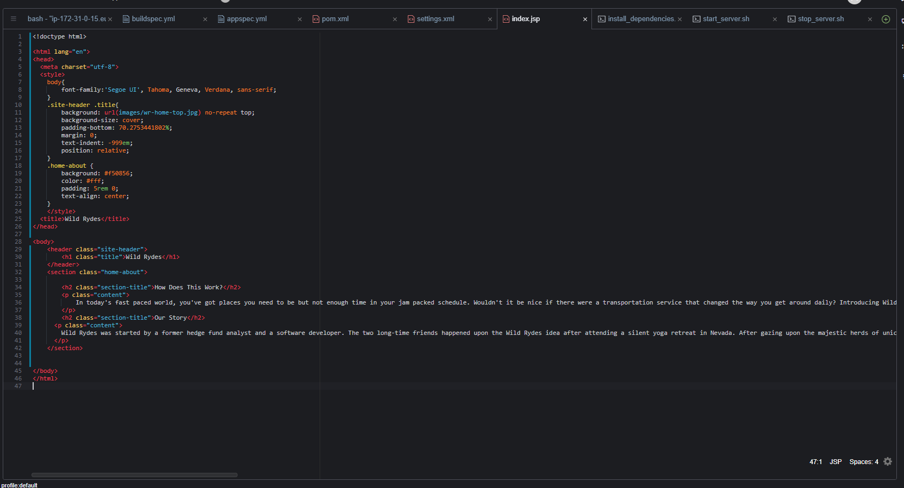
#

- Download the background image  and save it to your local machine. Then create a new folder images below unicorn-web-project/src/main/webapp/images/ and upload the file via Cloud9 using File > Upload Local File...

- Commit the changes using the command below:

```bash

cd ~/environment/unicorn-web-project/
git add *
git commit -m "Visual improvements to homepage"
git push -u origin main

```
#
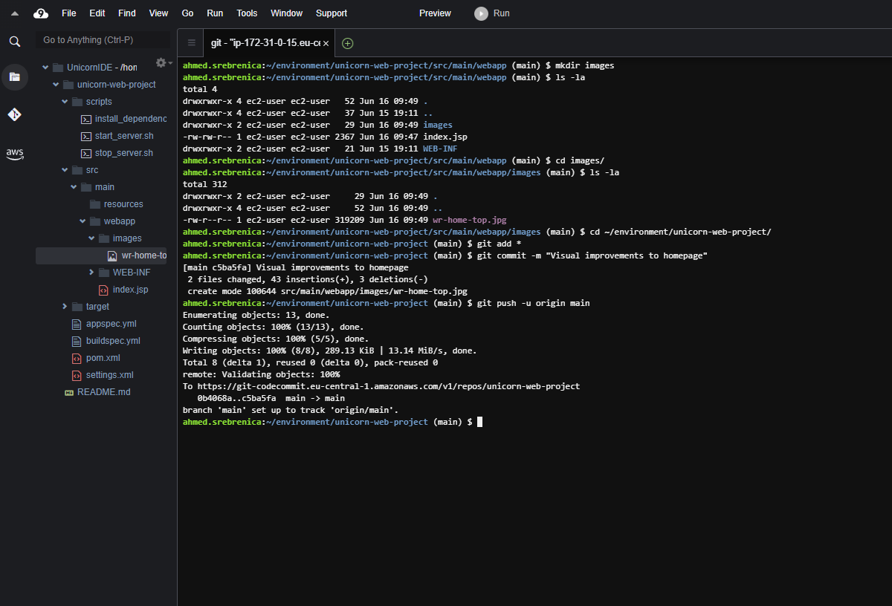
#

- Check back in the CodePipeline console. The pipeline should be triggered by the push automatically. Wait for the pipeline to complete successfully (this should take no longer than 5 mins).

#

#

- Once the pipeline has finished, browse to the EC2 public IP address http://<ip-address>/ to see the changes.

#
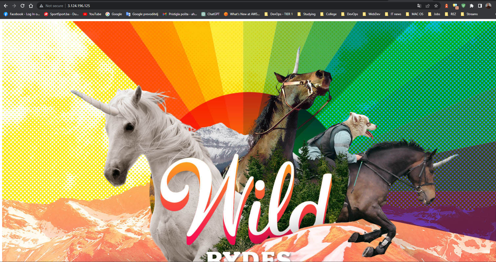
#

Congratulations! You now have a working CI/CD pipeline using the AWS Code services.

## Extending the pipeline

In this lab we will look at extending our existing CodePipeline pipeline to include a manual approval step before deploying to a production server.

Our current pipeline looks like this:

#
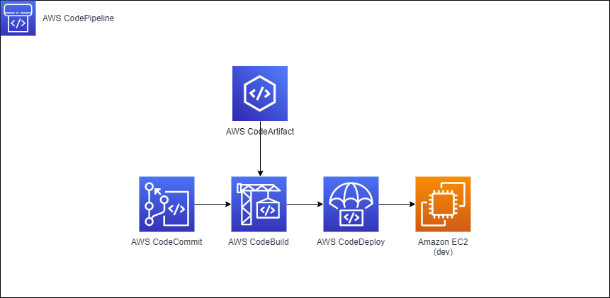
#

At the end of the lab the pipeline will look like thi

#

#

## Update the CloudFormation stack

First, we will update our CloudFormation stack to include an additional EC2 instance which will act as our production server

- Log into the AWS Console and go to the CloudFormation console.

- Download the provided CloudFormation YAML Template .

- In the CloudFormation console click on the UnicornStack and click Update.

- Click Replace current template and upload the file downloaded from step 2.

- Proceed with the next steps using Next until you arrive at the Review page.

- Confirm the IAM changes and click Update stack. This will take a few minutes to complete.

#
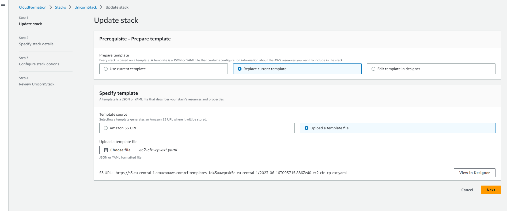
#
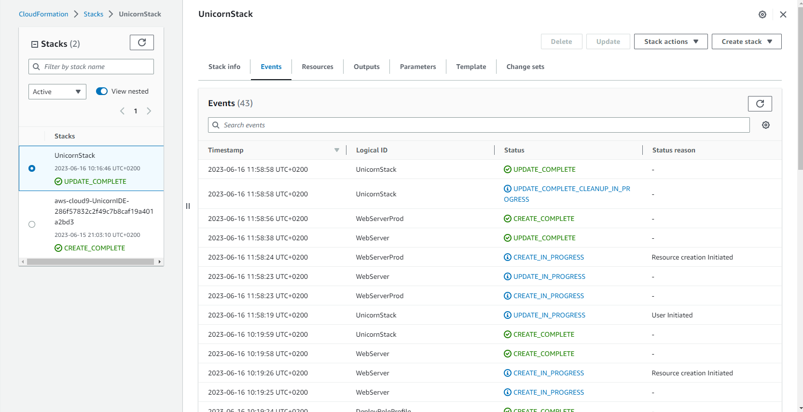
#

## Add an additional CodeDeploy deployment group

Now we need to add a production server deployment group in CodeDeploy

- Log into the AWS Console and go to the CodeDeploy service.

- Click on Applications and go to the unicorn-web-deploy application.

- Under the deployment groups tab click Create deployment group.

- Configure the following settings:

Deployment group name = unicorn-web-deploy-group-prod
Service role = UnicornCodeDeployRole
Deployment type = In-place
Environment configuration = Amazon EC2 instances
Tag group 1 Key = role
Tag group 1 Value = webserverprd
Install CodeDeploy Agent = Now and schedule updates (14 days)
Deployment configuration = CodeDeployDefault.AllAtOnce
Load balancer = Uncheck enable load balancing

- Click Create deployment group.

#
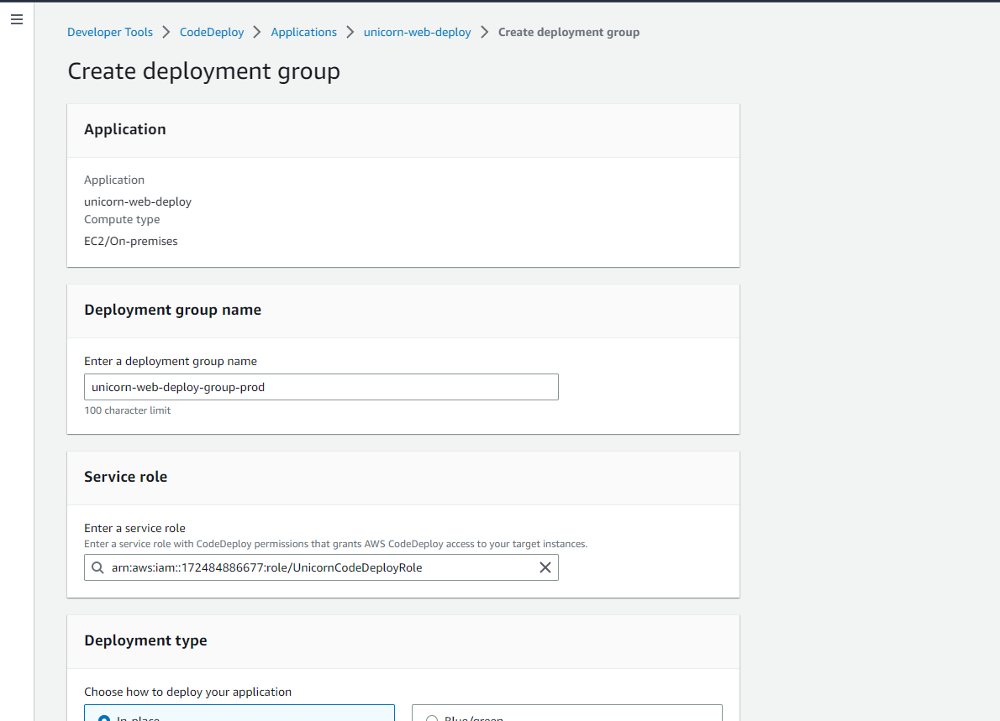
#
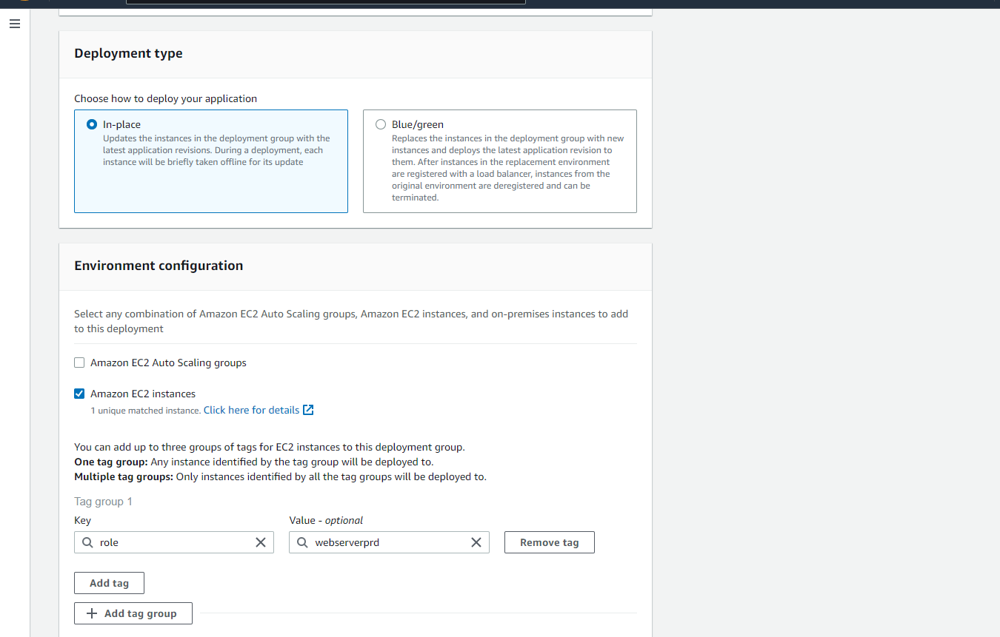
#
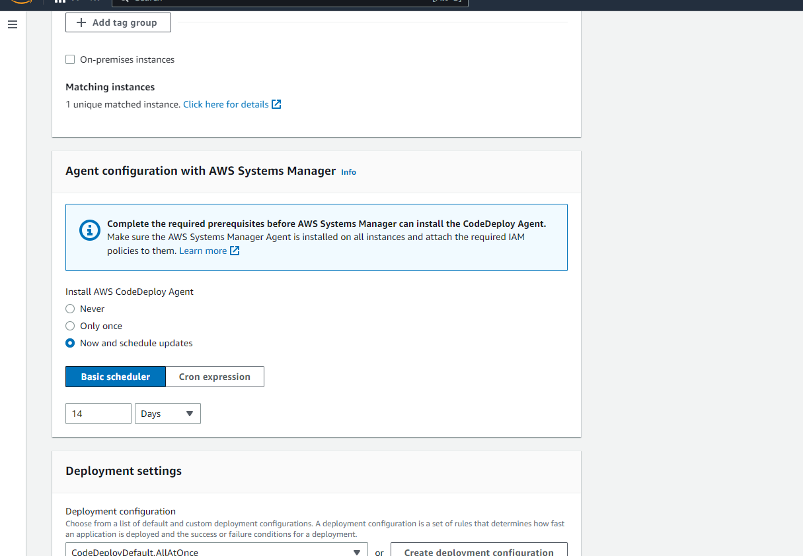
#
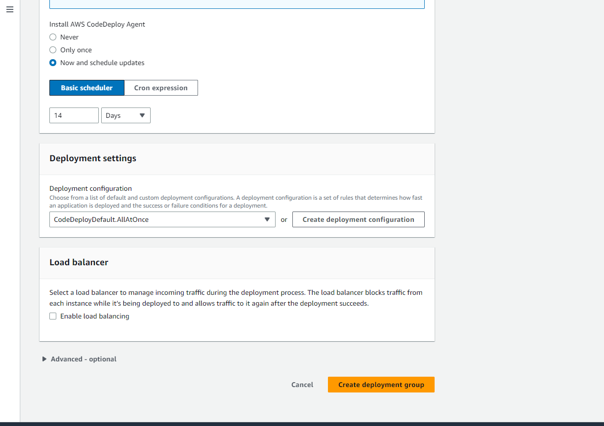
#

## Create SNS topic

We will create an SNS topic to be used for manual approvals in the next section.

- Log into the AWS Console and go to the SNS console.

- On the left menu bar click on Topics then click Create topic.

- Set the type to be Standard and the name to be unicorn-pipeline-notifications. Leave everything else as default and click Create topic.

#
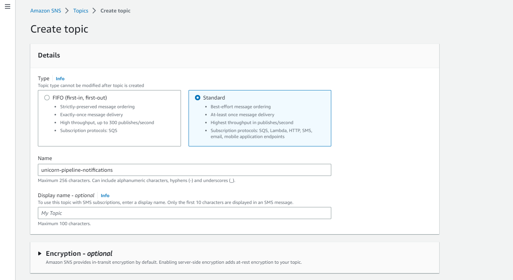
#

- Under subscriptions click Create subscription. Set the protocol to be Email and enter your email address. Click Create subscription.

- Log into your emails, where should have an email with the subject AWS Notification - Subscription Confirmation. Click the link to confirm the subscription.

#
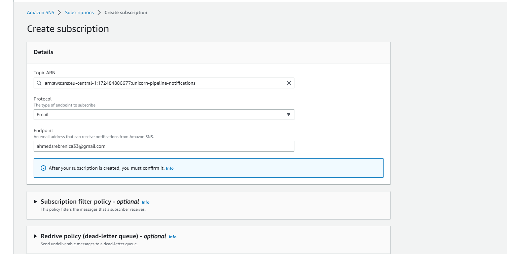
#
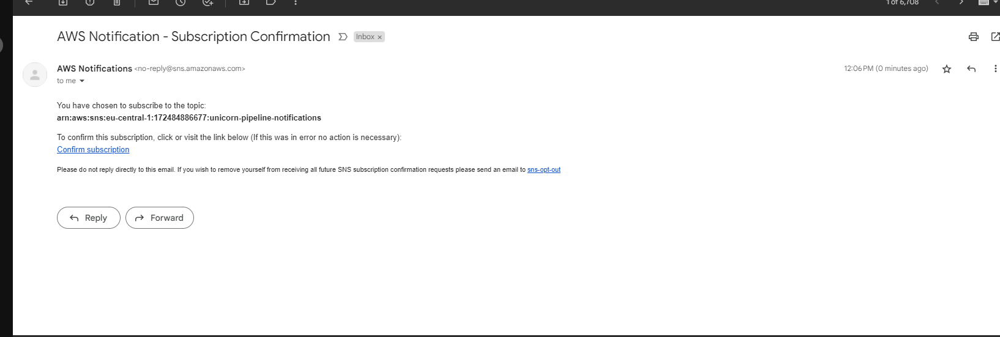
#
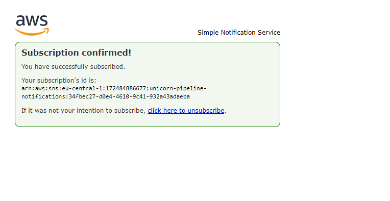
#

## Update CodePipeline

Now we need to add in our manual approval step and the deployment to the production web server

- Log into the AWS Console and go to the CodePipeline console.

- Click on the unicorn-web-pipeline and click Edit (you need to view the pipeline details to see the edit button). The following view should become visible.

#
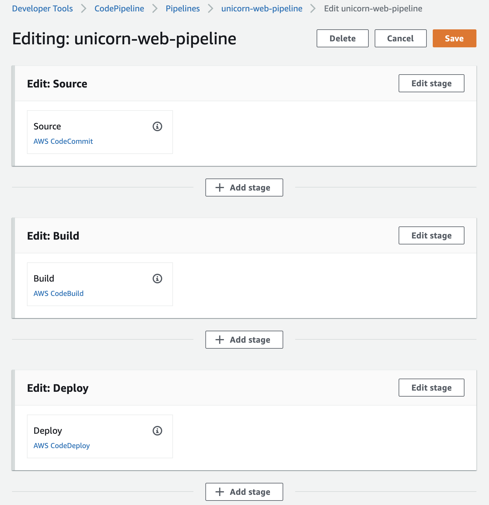
#

- Under the Deploy stage click Add stage. Name the stage Approval and click Add stage.

- In the newly created Approval stage click Add action group. Set the action name to be ProductionApproval and the action provider to be Manual approval. Set the SNS topic ARN to be unicorn-pipeline-notifications which we created earlier. Leave the other options blank and click Done.

- Now add another Stage after the approval named DeployProd.

- Add an action group in this stage named DeployProd. Set the action provider to be AWS CodeDeploy and the input artifact to be BuildArtifact. For the application name select unicorn-web-deploy and unicorn-web-deploy-prod for the deployment group.

- Click Done and then click Save to save the pipeline changes. You will need to click Save again on the popup screen.

#
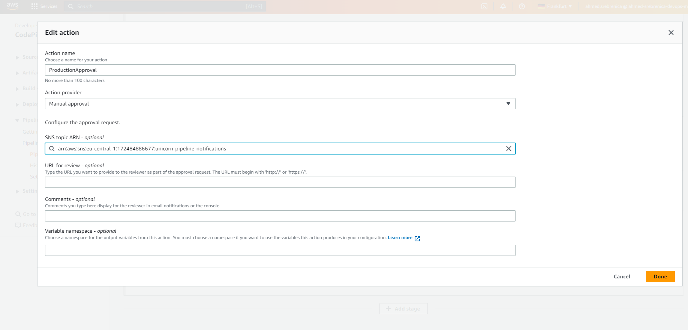
#
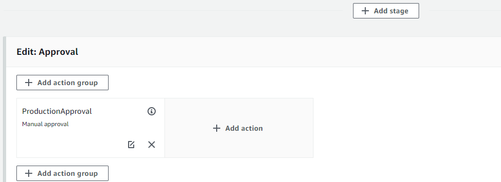
#

#

## Testing the new pipeline

- Click on the unicorn-web-pipeline in the CodePipeline console.

- Click Release change and click Release.

- Wait for the pipeline to reach the manual approval stage and then check your emails for an approval link. Note: you can also approve this directly in the AWS Console.

- Click Review under the approval stage and in the review box add some comments and click Approve

#
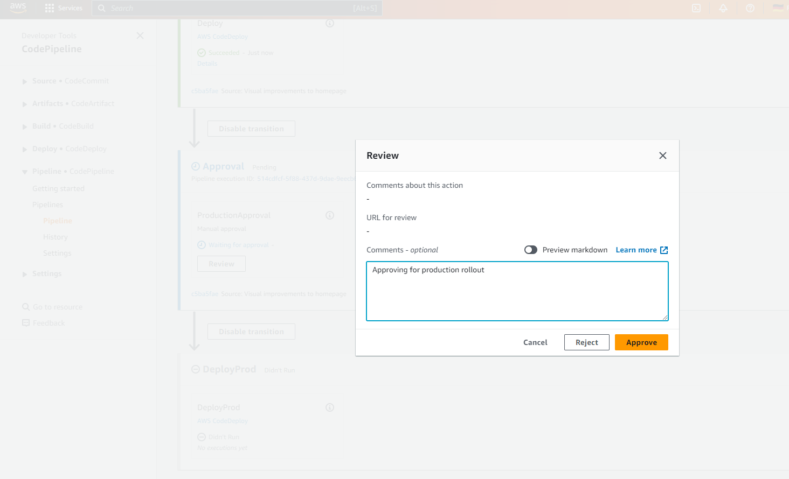
#

Once approved the pipeline will continue onto the production CodeDeploy stage after a few seconds.

- Ensure the pipeline completes successfully and then check the EC2 instance UnicornStack::WebServerProd public IP address is running the web application!

#
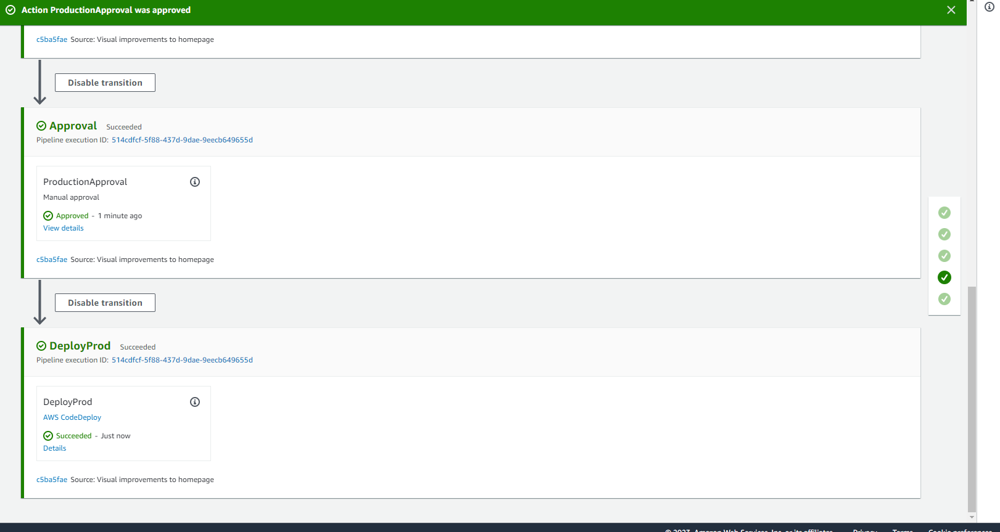
#
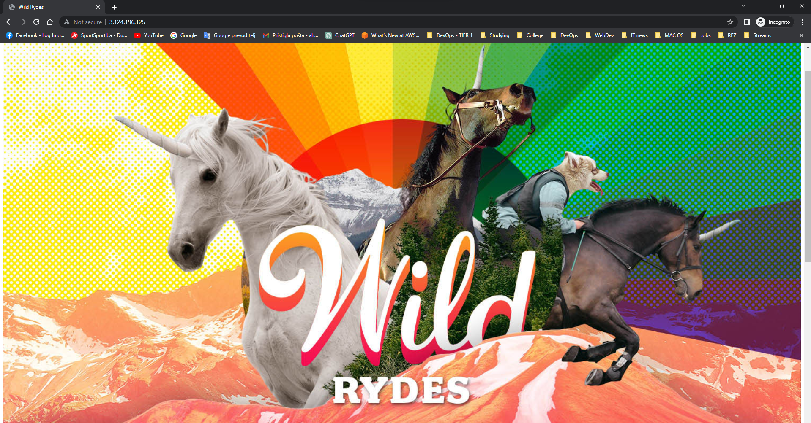
#

Congratulations, you have now successfully extended the CodePipeline by an approval stage that separates development and production deployments.


