- [x] Kreirati DNS record `<ime>-<prezime>.awsbosnia.com` za Hosted Zone awsbosnia.com (Hosted zone ID: Z3LHP8UIUC8CDK) koji ce da pokazuje na EC2 instancu koju ste krairali. Za kreiranje DNS zapisa korisite AWS CLI AWS kredencijale koji se nalaze unutar sljedeceg excel file-a **dostupan u TASK8**. AWS CLI konfigurisite tako da koristite named profile aws-bosnia. Kako da podesite AWS CLI i vise o CLI profilima mozete vidjeti [ovdje](https://docs.aws.amazon.com/cli/latest/reference/route53/change-resource-record-sets.html#)
Za ovaj dio taska mozete da iskorisite `change-resource-record-sets` AWS CLI komandu. Kada ste dodali novi DNS record njegov Name i Value ispiste uz pomoc komande `aws route53 list-hosted-zones` i alata `jq` gdje cete prikazati samo Name i Value za DNS record koji ste vi kreirali odnosno za vase domensko ime.*

1. `$ aws configure`
Za `AWS Access Key ID` i `Secret Access Key` unosimo podatke koje smo dobili u excel file-u u TASK 8.
`Default region name` - `eu-central-1` za IAM 1
`Default output format` - `json` radi lakšeg prikaza

Output komande izgleda kao na slici ispod, s tim da unosimo svoje podatke.

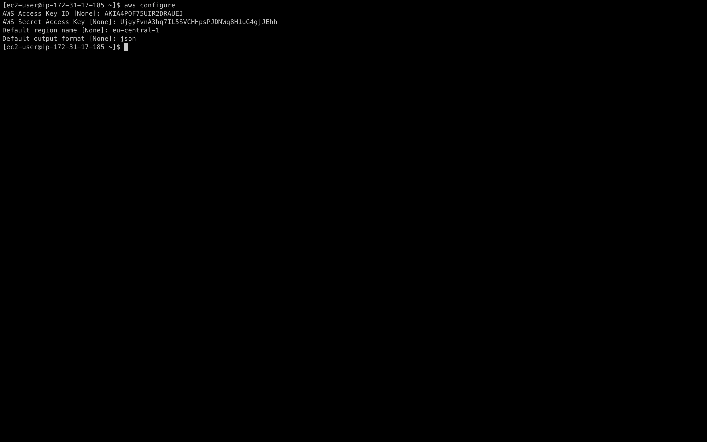

1. `$ aws configure list` da vidimo podešenu konfiguraciju

2. Komanda `change-resouce-record`
```bash 
$ aws route53 change-resource-record-sets --hosted-zone-id Z3LHP8UIUC8CDK --change-batch '{"Changes":[{"Action":"CREATE","ResourceRecordSet":{"Name":"ahmed-srebrenica.awsbosnia.com.","Type":"A","TTL":300,"ResourceRecords":[{"Value":"3.70.161.138"}]}}]}'
```
* `Name` - upisujemo svoj DNS record
* `Value` - upisujemo IP adresu instance 

1. `$ yum install jq` instaliramo `jq` alatku
2. Kada smo kreirali DNS record, Name i Value ispišemo pomoću komande
```bash
aws route53 list-resource-record-sets --hosted-zone-id Z3LHP8UIUC8CDK | jq '.ResourceRecordSets[] | select(.Name == "ahmed-srebrenica.awsbosnia.com.") | {Name, Value}'
```
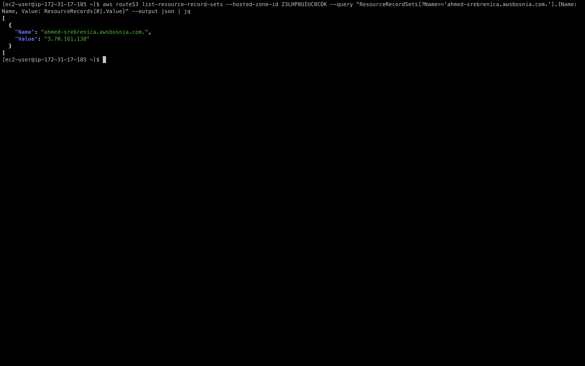


- [x] Na EC2 instanci `ec2-ime-prezime-task-8` kreirati Let's Encrypt SSL certifikat za vasu domenu. Neophodno je omoguciti da se nodejs aplikaciji moze pristupiti preko linka `https://<ime>-<prezime>.awsbosnia.com`, to verifikujte skrinsotom gdje se vidi validan certifikat u browseru.*

Za kreiranje Lets Encrypt certifikata iskorisiti cemo [certbot](https://certbot.eff.org/) alat. **Certbot** je alat koji nam omogucava da automatski generisemo i instaliramo SSL certifikat.
*Na Amazon Linux Ami 3 cert bot cemo instalirati koristeci **pip alat**.*

```bash
Komande u AWS CLI

sudo dnf install python3 augeas-libs
sudo python3 -m venv /opt/certbot/
sudo /opt/certbot/bin/pip install --upgrade pip
sudo /opt/certbot/bin/pip install certbot certbot-nginx
sudo ln -s /opt/certbot/bin/certbot /usr/bin/certbot
sudo ls -la /usr/bin/certbot # da vidimo link 
sudo certbot certonly --nginx # I am feeling conservative :) you can use sudo certbot --nginx instead to automatize the process
```
#### Zahtjev certifikata za nasu domenu
Output komande `sudo certbot certonly --nginx`:

* dodamo email adresu
* prihvatimo uslove koristenja
* Mozemo i ne moramo prihvatiti da na email salju emails sa ponudama i sl.
* unesemo domene u dole oznacenom polju  `Please enter the domain name(s)...`

```bash
[root@ip-172-31-91-148 ~]# sudo certbot certonly --nginx
Saving debug log to /var/log/letsencrypt/letsencrypt.log
Please enter the domain name(s) you would like on your certificate (comma and/or
space separated) (Enter 'c' to cancel): ahmed-srebrenica.awsbosnia.com, 
Requesting a certificate for ahmed-srebrenica.awsbosnia.com 

```


Successfully received certificate.
Certificate is saved at: /etc/letsencrypt/live/ahmed-srebrenica.awsbosnia.com/fullchain.pem
Key is saved at:         /etc/letsencrypt/live/ahmed-srebrenica.awsbosnia.com/privkey.pem
This certificate expires on 2023-07-18.
These files will be updated when the certificate renews.

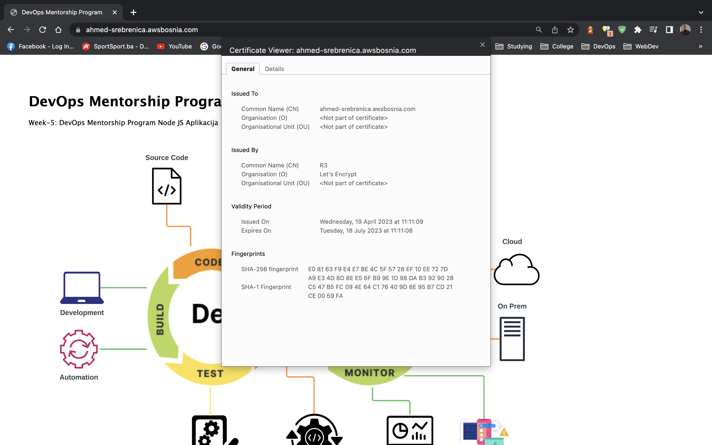

- [x] Omoguciti autorenewal SSL certifikata

Certbot posjeduje automatizme koji omogucavaju renewal tj. automatsko obnavljanje certifikata uz pomoc `cronjob`-a.
*Link ka koracima i objasnjenju pogledati na [linku](https://eff-certbot.readthedocs.io/en/stable/using.html#setting-up-automated-renewal)*

Komanda koja ce dodati cronjob u `/etc/crontab`
```bash
SLEEPTIME=$(awk 'BEGIN{srand(); print int(rand()*(3600+1))}'); echo "0 0,12 * * * root sleep $SLEEPTIME && certbot renew -q" | sudo tee -a /etc/crontab > /dev/null
```
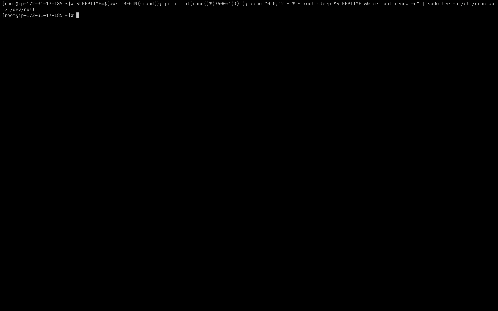

- [x] Koristeci openssl komande prikazati koji SSL certitikat koristite i datum njegovog isteka. Probajte korisitit razlicite openssl komande (HINT: Biljeskama za office hours imate knjigu u kojoj mozete pronaci recepte za razlicite openssl komande)

Koristimo komandu:

```bash
openssl s_client -showcerts -connect <ime-prezime>.awsbosnia.com:443
```


ili 
```bash
openssl s_client -showcerts -connect ime-prezime.awsbosnia.com:443 2>/dev/null | openssl x509 -noout -dates
```
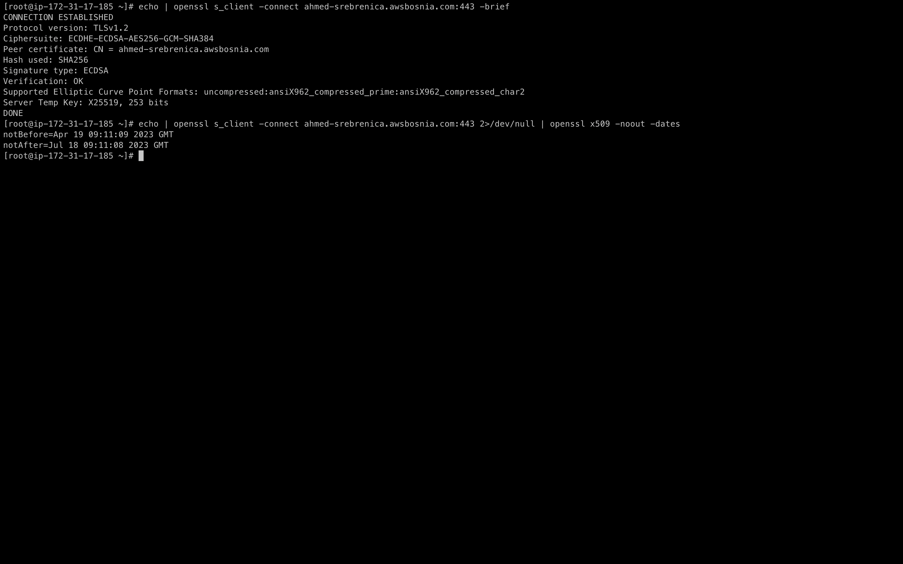


- [x] Importujte Lets Encrypt SSL certifikat unutar AWS Certified Managera.

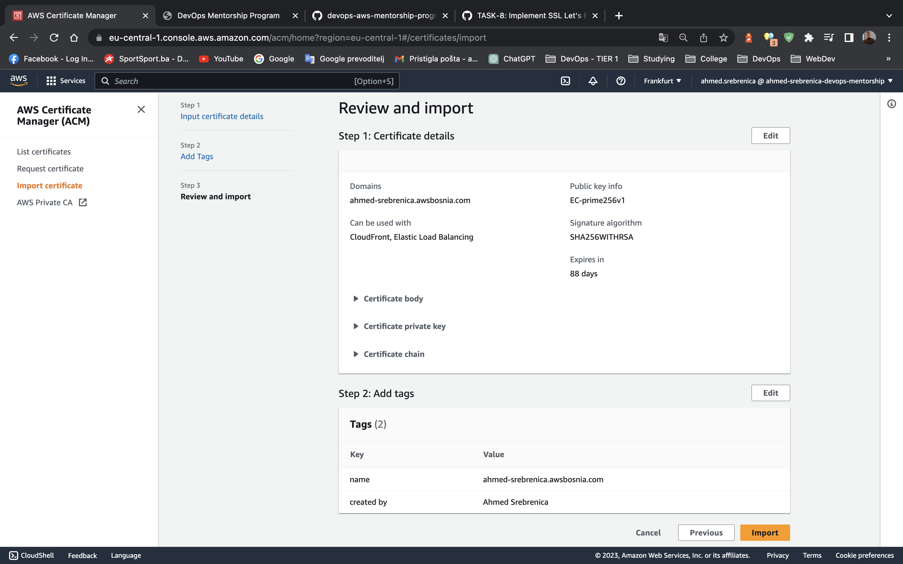
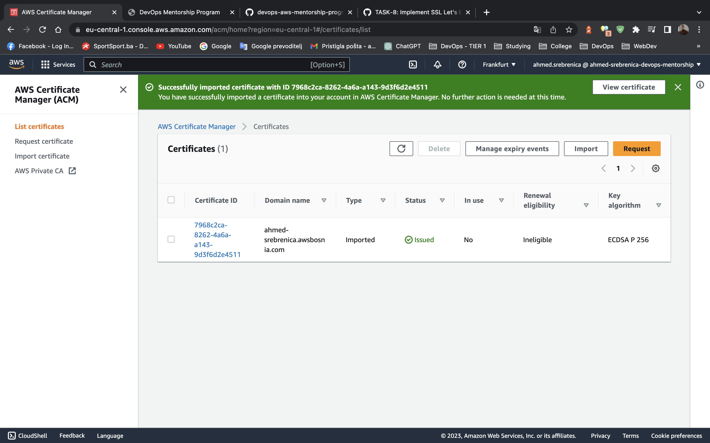

 - [x] Kreirajte Load Balancer gdje cete na nivou Load Balancera da koristite SSL cert koji ste ranije importovali. (Hint: NGINX config je nophodno auzrirati). Load Balancer u pozadini koristi EC2 instancu ec2-ime-prezime-task-8, nije potrebno kreirati ASG.

 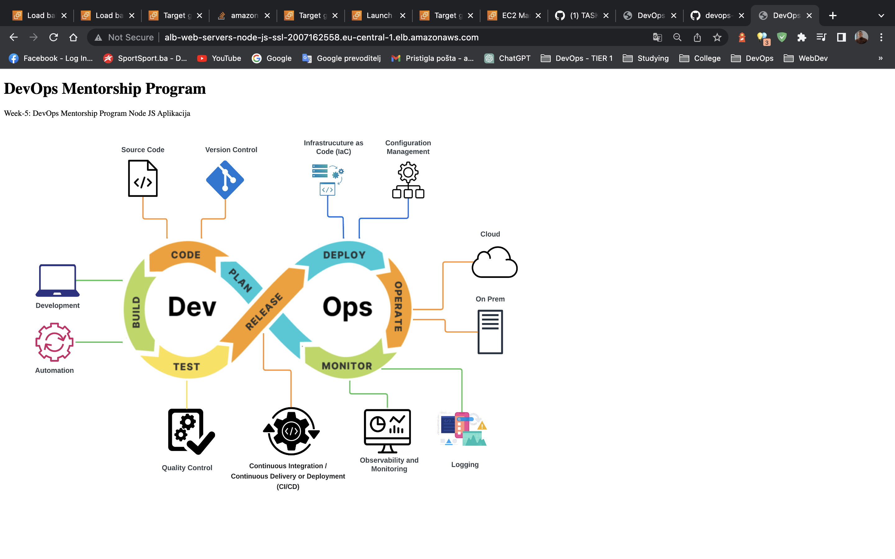
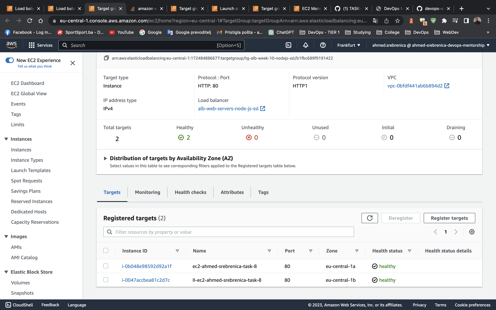


- [x] Koristeci openssl komande prikazati koji SSL certitikat koristite za vasu domenu i datum njegovog isteka.

```bash
openssl s_client -showcerts -connect ime-prezime.awsbosnia.com:443 2>/dev/null | openssl x509 -noout -text
```
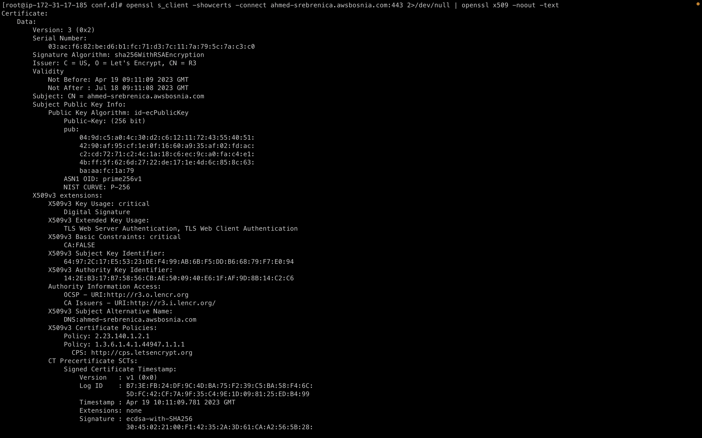


- [x] Kreirajte novi SSL certifikat unutar AWS Certified Managera, azurirajte ALB da koristi novi SSL cert koji ste kreirali.

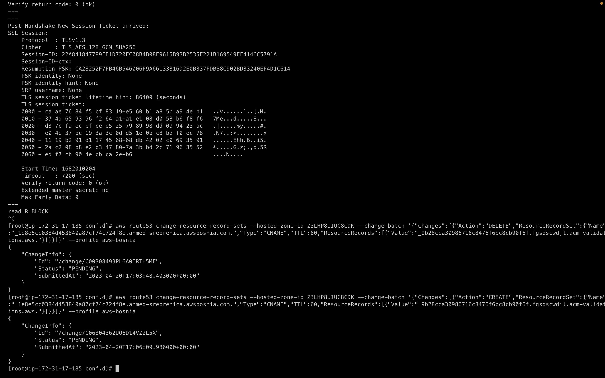

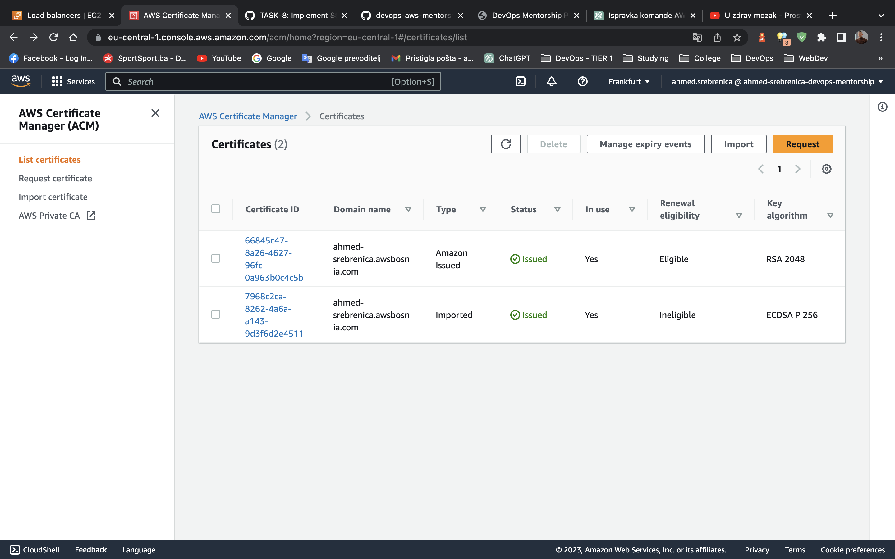

- [x] Koristeci openssl komande prikazati koji SSL certitikat koristite za vasu domenu i datum njegovog isteka.

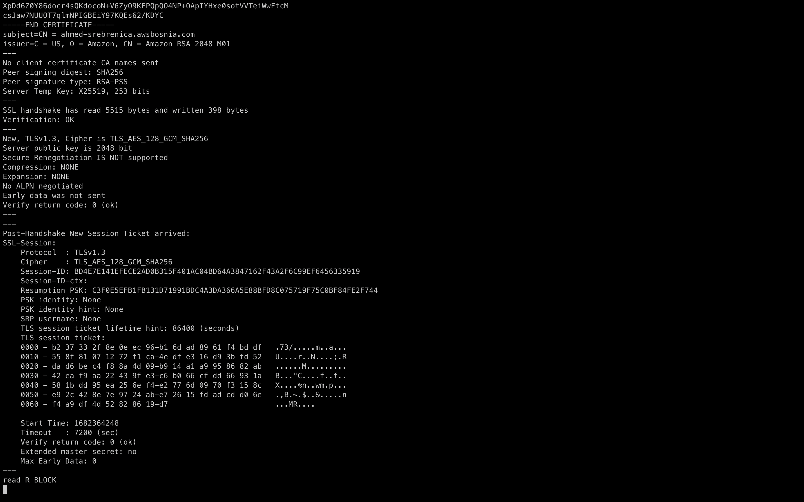
