# TASK-12 Packer - > Ansible -> CloudFormation / Terrafrom 

**If you want to see how my files look like, you can check the direcories I uploaded. Also, I uploaded screenshots of each step.**

- [x]  [PACKER] - Create Custom AMI image from Amazon Linux 3 AMI image where you will have needed yum repos installed and enabled to install nginx web server and mysql database.

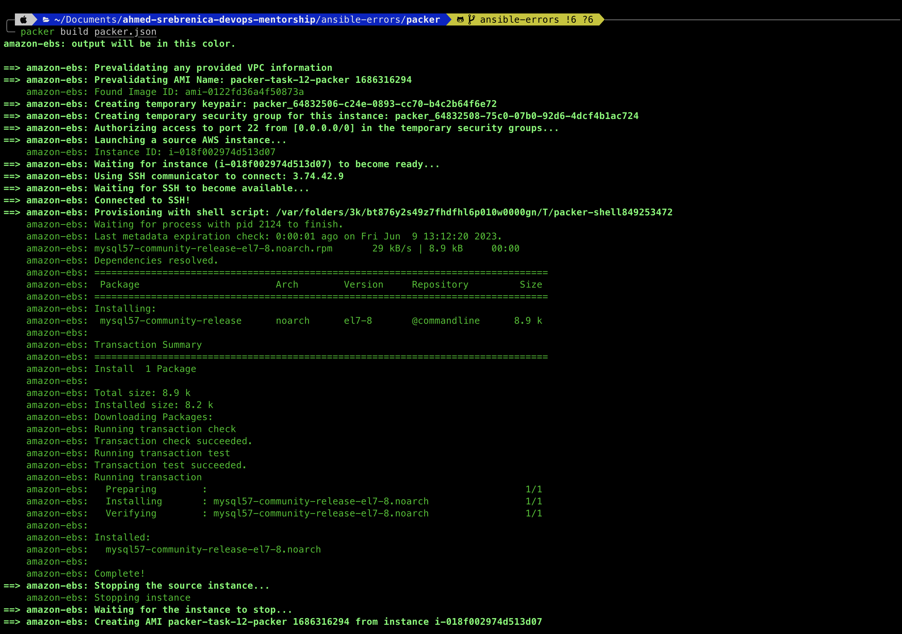
#
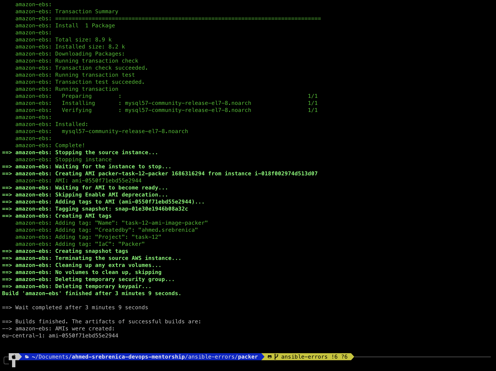
#
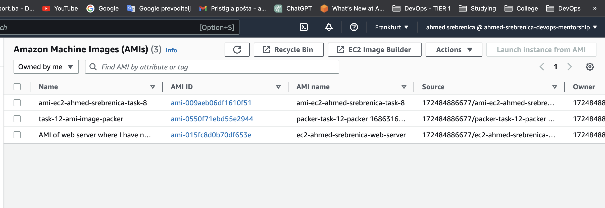
#
- [x] [IaC - CloudFormation] Using an AMI image from step 1 create 2 new EC2 instances called task-12-web-server-cf and task-12-db-server-cf. For those instances create appropriate security groups and open needed ports. Please try to follow best practices for security groups. You can put your resources inside default VPC and public subnets.
#
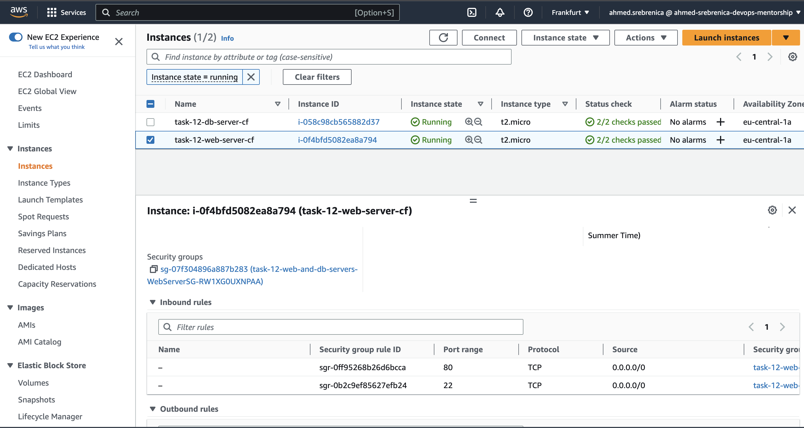
#
- [x] [IaC - Terraform] Using an AMI image from step 1 create 2 new EC2 instances called task-12-web-server-tf and task-12-db-server-tf. For those instances create appropriate security groups and open needed ports. Please try to follow best practices for security groups. You can put your resources inside default VPC and public subnets.
#

#
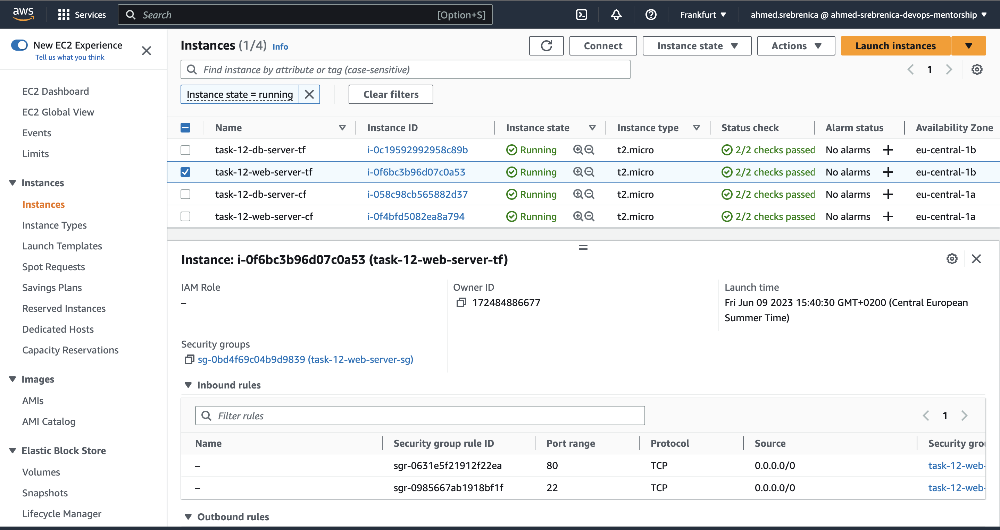
#
- [x] [Ansible] By using ansible provisioner install nginx web server on task-12-web-server-cf and task-12-web-server-tf instances. By using ansilbe provisioner install mysql database on task-12-db-server-cf and task-12-db-server-tf instances.
#
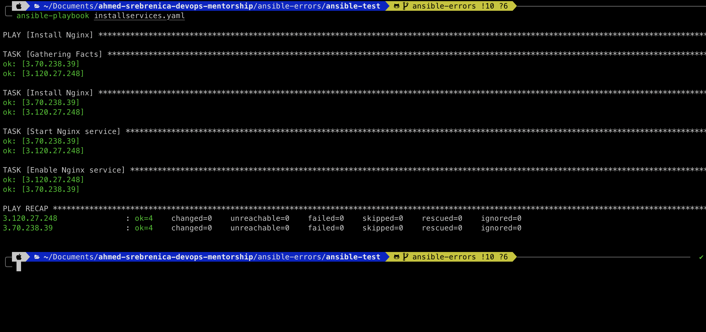
#
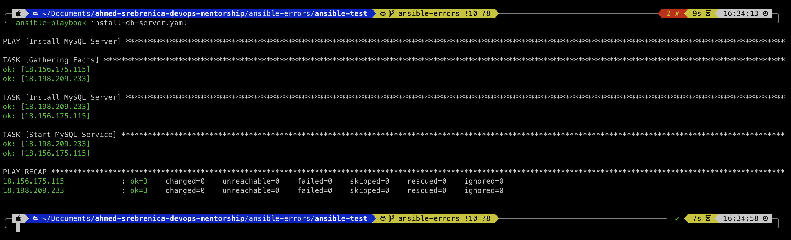
#
- [x] Your nginx web server instances needs to have index.html file with content Hello from nginx web server created using CloudFormation and Ansible Hello from nginx web server created using Terrafrom and Ansible. 
#
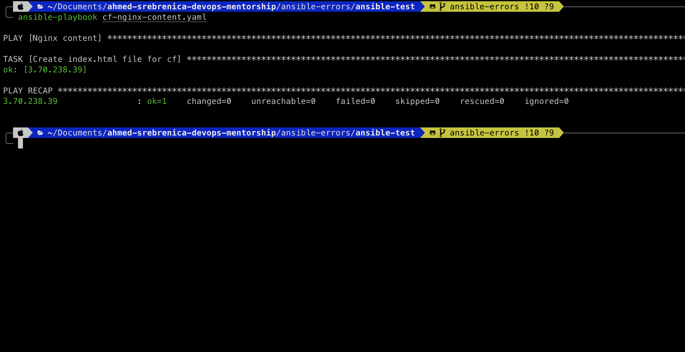
#
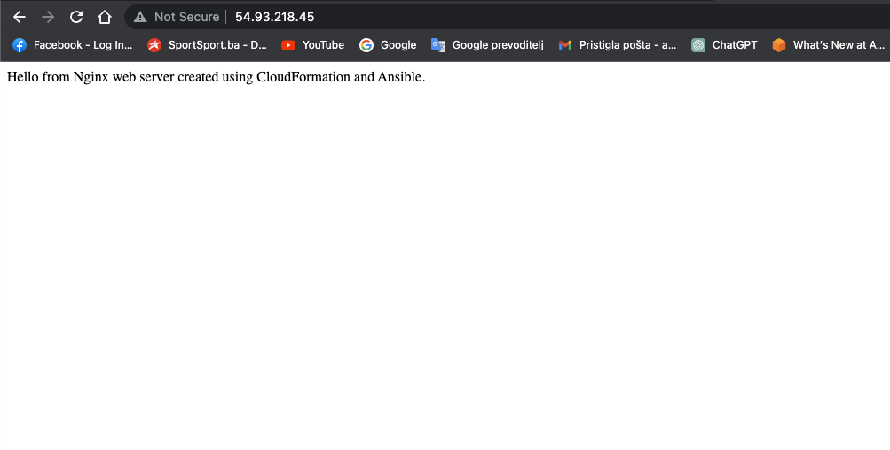
#
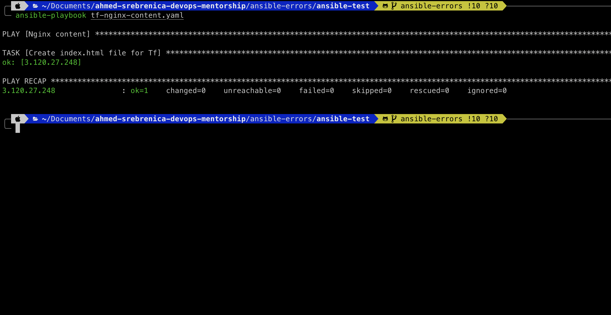
#
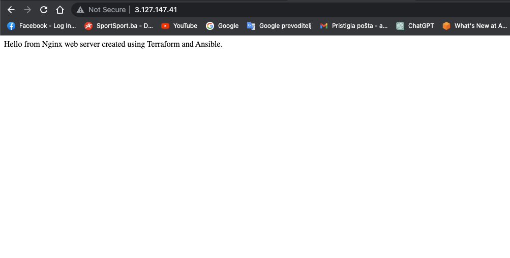
#
- [x] Mysql database needs to have database called task-12-db and user task-12-user with password task-12-password and all privileges on task-12-db database.
#
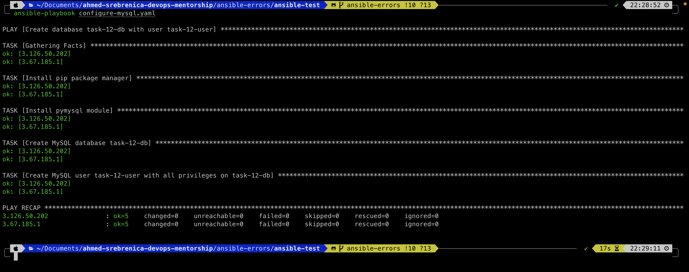
#
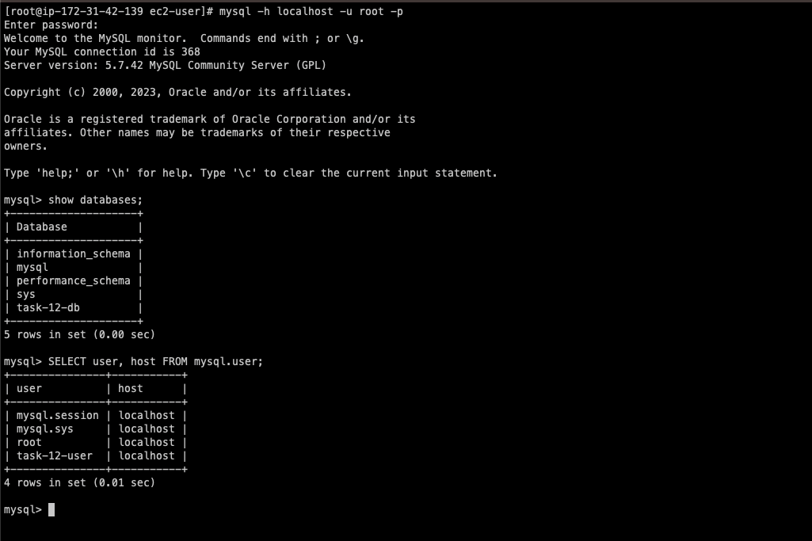
#
- [x] [Ansible] By using Ansible task verify connection via default mysql database port from task-12-web-server-cf and task-12-web-server-tf instances to task-12-db-server-cf and task-12-db-server-tf instances. For the connection verification you can use telnet tool.
#
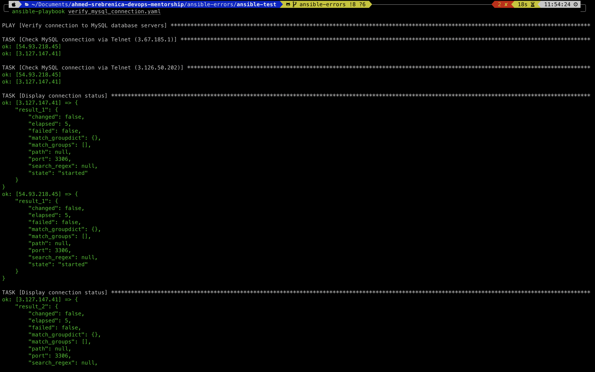
#
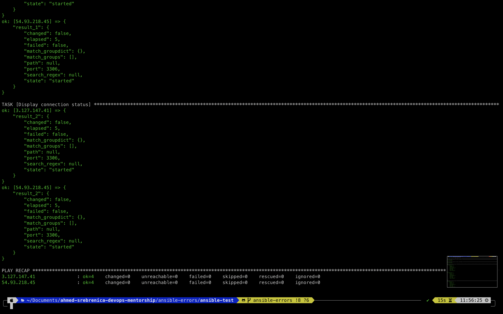
